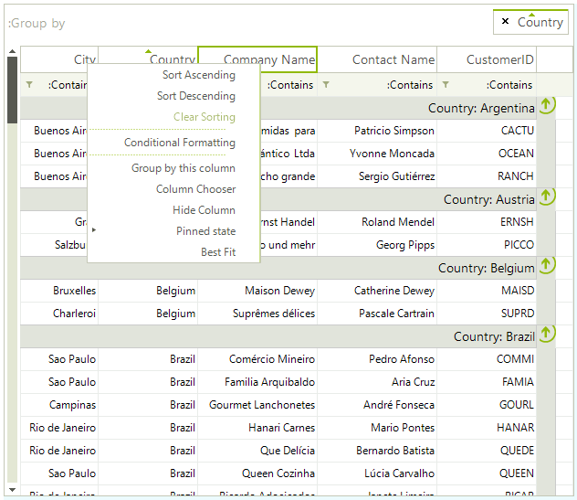

# Right-to-left support

You can present the content of your grid instance in a right-to-left direction by setting the __RightToLeft__ property to *Yes*:

<snippet id='gridview-localization1-rtl-cs' />
<snippet id='gridview-localization1-rtl-vb' />

# See Also
* [Localization]()

