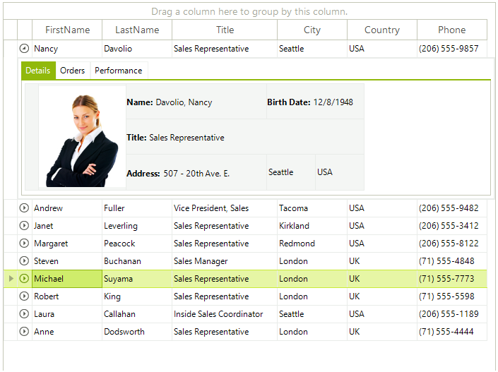
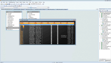

# WinForms GridView Overview

__RadGridView__ is a grid component developed on top of [Telerik Presentation Framework]() which provides a combination of performance, extensibility, and ease of use. Its flexible hierarchy model allows the use of different data providers and the creation of highly interactive interfaces for the display and management of large data without performance loss.





>caption Figure 1: RadGridView layout. 

## Key Features

* __Easily customizable appearance and theming mechanis__: RadGridView offers four flexible methods for customizing its appearance: Themes, the UI Editor (DesignTime), Events, and Conditional Formatting. Each method has its specific use case, although they may overlap, providing developers with multiple options to fine-tune the look and feel of the control. Themes allow for global styling changes, while the UI editor simplifies design-time adjustments. Events enable dynamic appearance changes during runtime, and Conditional Formatting applies specific styles based on cell values or conditions. [Read more]()

* __Outstanding Performance__: RadGridView delivers cell and row virtualization by utilizing container reuse and recycling, which further enhances grid performance and reduces memory footprint. [Read more]()

* __Binding to a wide set of binding sources__: RadGridView can be bound to various data source types as well can work in so called Unbound mode, where the grid is not bound to any data and using the grid API.  [Read more]()

* __Flexible Hierarchy Model__: RadGridView has an extremely flexible hierarchy model, which allows meaningful organization of complex data. [Read more]()

* __Self Referencing Hierarchy__: Often tabular data defines a hierarchical relationship with itself. This approach is used to model tree-like structures that can be nested to arbitrary depths. RadGridView supports that scenario through its self-reference hierarchy feature that allows you to define a relation that points back to the same table. [Read more]()

* __Filtering__: The control has built-in filtering support out of the box. You can get this functionality by enabling it. [Read more]()

* __Grouping__: The users can interactively organize their data in a way that suits best their needs with a single drag and drop action. Data can be grouped according to several criteria effectively creating a tree of groups with the leaf nodes holding the actual data records. [Read more]()

* __Sorting__: RadGridView has built-in sorting support out of the box. You get this functionality enabled by default. Just click on the header of the column you wish to have your data sorted by and you are ready.  [Read more]()

* __Paging__: The data layer of RadGridView supports pagination, allowing large datasets to be broken into manageable pages for improved performance and user experience. Developers can easily configure and customize the paging behavior to suit specific application needs. [Read more]()

* __Searching__: RadGridView control allows you to perform search operations on the displayed data. This build-in search functionality is available for both end users and developers. The search mechanism executes in a separate thread which leaves the UI responsive at all times. [Read more]()

* __Printing__: The control expose printing support, which allows you to print the grid content. [Read more]()

* __Summary rows and totals row with Aggregate Functions__: RadGridView allows the use of summary rows to display key information about the dataset, such as the first item, last item, and total count. These summary rows can be pinned at the top or bottom and are available for use in both flat grid views as well as in grouped or hierarchical layouts. [Read more]()

* __Pinned (Frozen) columns__: RadGridView allows you to keep part of your data always visible putting the rest of it in context. [Read more]()

* __Pinned rows__: RadGridView provides a mechanism for pinning particular rows to the top of the control so that they do not participate in the vertical scrolling. A detailed explanation of this feature can be found in the [Pinned Rows]() article.

* __Row and column reordering__: RadGridView supports row reordering and it can be done by the user at runtime. The user just has to drag the desired row at the desired position between two other rows and drop it there. [Read more]()

* __Merged Cells__: As of __Q3 2024__ we have introduced support for merged cells in RadGridView control. As a result the serial cells with equal values can be merged vertically or horizontally. [Read more]()

* __Column grouping and HTML table-like layouts__: You can customize the control visual appearance and behavior by using a view definition. You can customize the layout in three different view definitions: TableViewDefinition(default), ColumnGroupsViewDefinition, and HtmlViewDefinition. [Read more]()

* __In-place data editing with validation and error indication__: he control offers intuitive in-cell data editing, with a flexible API that allows developers to easily customize the built-in editors. It also supports seamless integration of data validation mechanisms, enabling developers to provide real-time error feedback for invalid inputs. [Read more]()

* __Selection and navigation__: The control supports single and multiple record selections that can be manipulated both with the mouse and with the keyboard. [Read more]()

* __Exporting data in different file formats__: RadGridView provides built-in methods for exporting its data to various formats. [Read more]()

* __Localization and right-to-left support__: The control expose localization mechanism to display control text and messages in a specific language. [Read more](). A part from the, you can present the content of your grid instance in a right-to-left direction. [Read more]()

* __Flexible API__: RadGridView control provide a rich and flexible API, which will let the developers easily customize the layout or the behavior of the control. Furthermore, the API will be similar to the API of our existing controls, so it will be easier for those who have already used our products to use any other new component from our __Telerik UI for WinForms__ suite.

| RELATED VIDEOS |  |
|----|----|

|[RadGridView for WinForms Webinar](https://www.telerik.com/videos/radgridview-for-winforms-webinar)This video provides an in-depth overview of Telerik's RadGridView for WinForms||

## Telerik UI for WinForms Learning Resources
* [Telerik UI for WinForms GridView Homepage](https://www.telerik.com/products/winforms/gridview.aspx)
* [Get Started with the Telerik UI for WinForms GridView]()
* [Telerik UI for WinForms API Reference](https://docs.telerik.com/devtools/winforms/api/)
* [Getting Started with Telerik UI for WinForms Components]()
* [Telerik UI for WinForms Virtual Classroom (Training Courses for Registered Users)](https://learn.telerik.com/learn/course/external/view/elearning/17/TelerikUIforWinForms) 
* [Telerik UI for WinForms Forum](https://www.telerik.com/forums/winforms)
* [Telerik UI for WinForms Knowledge Base](https://docs.telerik.com/devtools/winforms/knowledge-base)

## Telerik UI for WinForms Additional Resources
* [Telerik UI for WinForms Product Overview](https://www.telerik.com/products/winforms.aspx)
* [Telerik UI for WinForms Blog](https://www.telerik.com/blogs/desktop-winforms)
* [Telerik UI for WinForms Videos](https://www.telerik.com/videos/product/winforms)
* [Telerik UI for WinForms Roadmap](https://www.telerik.com/support/whats-new/winforms/roadmap)
* [Telerik UI for WinForms Pricing](https://www.telerik.com/purchase/individual/winforms.aspx)
* [Telerik UI for WinForms Code Library](https://www.telerik.com/support/code-library/winforms)
* [Telerik UI for WinForms Support](https://www.telerik.com/support/winforms)
* [What’s New in Telerik UI for WinForms](https://www.telerik.com/support/whats-new/winforms)

## See Also

 * [Getting started]()
 * [Key features]()
 * [Element Hierarchy]()
