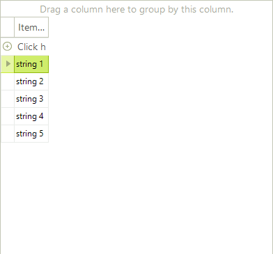
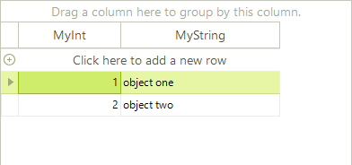

# Binding to Array and ArrayList

The examples below demonstrate binding to a generic list, an arrays of custom objects, and an `ArrayList` of custom objects. This collections have limitations when used as a data source in which case a __BindingList__ must be used. 

>note Note: BindingList is the preferred collection since its changes are automatically reflected on the data-bound control.
>

## Binding to a Array List

The example below creates an __ArrayList__ of generic objects initialized with five values and assigned as a __DataSource__ to the __RadGridView__.



{{source=..\SamplesCS\GridView\PopulatingWithData\BindingToArrayAndArrayList.cs region=bindingToSimpleArrayClass}} 
{{source=..\SamplesVB\GridView\PopulatingWithData\BindingToArrayAndArrayList.vb region=bindingToSimpleArrayClass}} 

````C#
public class ValueType<T>
{
    T item;
    public ValueType() { }
    public ValueType(T item)
    {
        this.item = item;
    }
    public T ItemProperty
    {
        get { return this.item; }
        set { this.item = value; }
    }
}

````
````VB.NET
Public Class ValueType(Of T)
    Private item As T
    Public Sub New()
    End Sub
    Public Sub New(ByVal item As T)
        Me.item = item
    End Sub
    Public Property ItemProperty() As T
        Get
            Return Me.item
        End Get
        Set(ByVal value As T)
            Me.item = value
        End Set
    End Property
End Class

````

{{endregion}} 

{{source=..\SamplesCS\GridView\PopulatingWithData\BindingToArrayAndArrayList.cs region=bindingToSimpleArray}} 
{{source=..\SamplesVB\GridView\PopulatingWithData\BindingToArrayAndArrayList.vb region=bindingToSimpleArray}} 

````C#
ArrayList list = new ArrayList();
for (int i = 0; i < 5; i++)
{
    list.Add(new ValueType<string>("string " + (i + 1).ToString()));
}
this.radGridView1.DataSource = list;

````
````VB.NET
Dim list As New ArrayList()
Dim i As Integer = 0
While i < 5
    list.Add(New ValueType(Of String)("string " + (i + 1).ToString()))
    System.Math.Max(System.Threading.Interlocked.Increment(i), i - 1)
End While
Me.RadGridView1.DataSource = list

````

{{endregion}} 

## Binding to an Array of Objects

Arrays of objects containing [bindable types]() can be bound to RadGridView by assigning the array to the __DataSource__ property of the grid. 
        

The example below defines a "MyObject" class containing one integer and one string property. The snippet of code at end of the example creates an array of MyObject, initializes the array with two objects and assigns the array to the __DataSource__. The MyObject class would typically be placed in its own separate class file and the array creation, initialization and assignment code might be placed in a form's `Load` event handler.

 

{{source=..\SamplesCS\GridView\PopulatingWithData\BindingToArrayAndArrayList.cs region=bindingToArrayOfObjectsClass}} 
{{source=..\SamplesVB\GridView\PopulatingWithData\BindingToArrayAndArrayList.vb region=bindingToArrayOfObjectsClass}} 

````C#
public class MyObject
{
    public MyObject(int myInt, string myString)
    {
        _myInt = myInt;
        _myString = myString;
    }
    private int _myInt;
    public int MyInt
    {
        get { return _myInt; }
        set { _myInt = value; }
    }
    private string _myString;
    public string MyString
    {
        get { return _myString; }
        set { _myString = value; }
    }
}

````
````VB.NET
Public Class MyObject
    Public Sub New(ByVal myInt As Integer, ByVal myString As String)
        _myInt = myInt
        _myString = myString
    End Sub
    Private _myInt As Integer
    Public Property MyInt() As Integer
        Get
            Return _myInt
        End Get
        Set(ByVal value As Integer)
            _myInt = value
        End Set
    End Property
    Private _myString As String
    Public Property MyString() As String
        Get
            Return _myString
        End Get
        Set(ByVal value As String)
            _myString = value
        End Set
    End Property
End Class

````

{{endregion}} 

{{source=..\SamplesCS\GridView\PopulatingWithData\BindingToArrayAndArrayList.cs region=bindingToArrayOfObjects}} 
{{source=..\SamplesVB\GridView\PopulatingWithData\BindingToArrayAndArrayList.vb region=bindingToArrayOfObjects}} 

````C#
MyObject[] myArray = new MyObject[2] { new MyObject(1, "object one"), new MyObject(2, "object two") };
radGridView1.DataSource = myArray;

````
````VB.NET
Dim myArray As MyObject() = New MyObject(1) {New MyObject(1, "object one"), New MyObject(2, "object two")}
        RadGridView1.DataSource = myArray

````

{{endregion}} 


# See Also
* [Bind to XML]()

* [Bindable Types]()

* [Binding to a Collection of Interfaces]()

* [Binding to BindingList]()

* [Binding to DataReader]()

* [Binding to EntityFramework using Database first approach]()

* [Binding to Generic Lists]()

* [Binding to ObservableCollection]()

