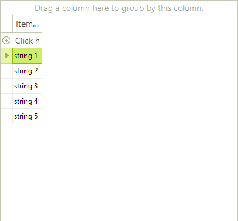
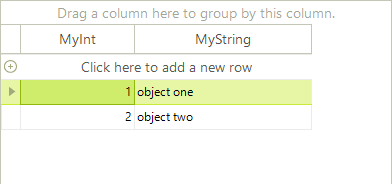

# Binding to Array and ArrayList

The examples below demonstrate binding to a generic list, an arrays of custom objects, and an `ArrayList` of custom objects. This collections have limitations when used as a data source in which case a __BindingList__ must be used. 

>note Note: BindingList is the preferred collection since its changes are automatically reflected on the data-bound control.
>

## Binding to a Array List

The example below creates an __ArrayList__ of generic objects initialized with five values and assigned as a __DataSource__ to the __RadGridView__.

<snippet id='gridview-bindingtoarrayandarraylist-bindingtosimplearrayclass-cs' />
<snippet id='gridview-bindingtoarrayandarraylist-bindingtosimplearrayclass-vb' />
<snippet id='gridview-bindingtoarrayandarraylist-bindingtosimplearray-cs' />
<snippet id='gridview-bindingtoarrayandarraylist-bindingtosimplearray-vb' />

## Binding to an Array of Objects

Arrays of objects containing [bindable types]() can be bound to RadGridView by assigning the array to the __DataSource__ property of the grid. 
        

The example below defines a "MyObject" class containing one integer and one string property. The snippet of code at end of the example creates an array of MyObject, initializes the array with two objects and assigns the array to the __DataSource__. The MyObject class would typically be placed in its own separate class file and the array creation, initialization and assignment code might be placed in a form's `Load` event handler.

 

<snippet id='gridview-bindingtoarrayandarraylist-bindingtoarrayofobjectsclass-cs' />
<snippet id='gridview-bindingtoarrayandarraylist-bindingtoarrayofobjectsclass-vb' />
<snippet id='gridview-bindingtoarrayandarraylist-bindingtoarrayofobjects-cs' />
<snippet id='gridview-bindingtoarrayandarraylist-bindingtoarrayofobjects-vb' />

# See Also
* [Bind to XML]()

* [Bindable Types]()

* [Binding to a Collection of Interfaces]()

* [Binding to BindingList]()

* [Binding to DataReader]()

* [Binding to EntityFramework using Database first approach]()

* [Binding to Generic Lists]()

* [Binding to ObservableCollection]()

