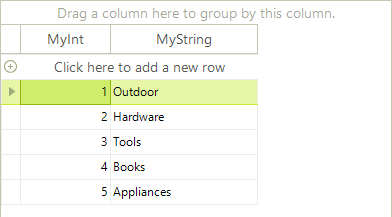

# Binding to BindingList

BindingList is a generic list type that has additional binding support. While you can [bind to a generic list](), BindingList provides additional control over list items, i.e. if they can be edited, removed or added. BindingList also surfaces events that notify when the list has been changed. The example below creates a list of `MyObject`, initializes the list and assigns the list to the grid __DataSource__ property. The example also uses a __ListChangedEventHandler__ that reports the type of change that occurred, the new index of the item and the content of the item.

<snippet id='gridview-bindingtobindinglist-myobjectclass-cs' />
<snippet id='gridview-bindingtobindinglist-myobjectclass-vb' />
<snippet id='gridview-bindingtobindinglist-bindingtobindinglist-cs' />
<snippet id='gridview-bindingtobindinglist-bindingtobindinglist-vb' />

# See Also
* [Bind to XML]()

* [Bindable Types]()

* [Binding to a Collection of Interfaces]()

* [Binding to Array and ArrayList]()

* [Binding to DataReader]()

* [Binding to EntityFramework using Database first approach]()

* [Binding to Generic Lists]()

* [Binding to ObservableCollection]()

