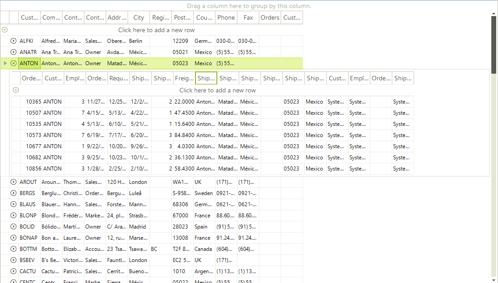
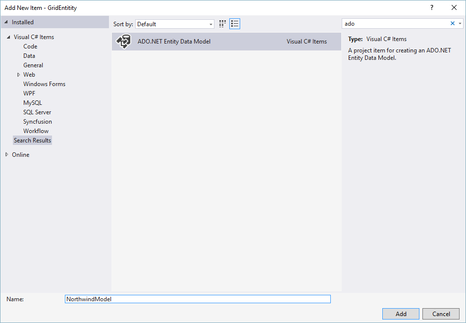
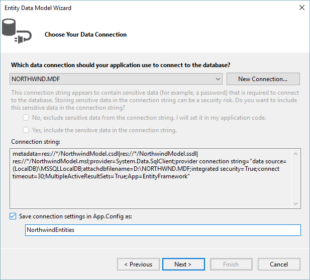
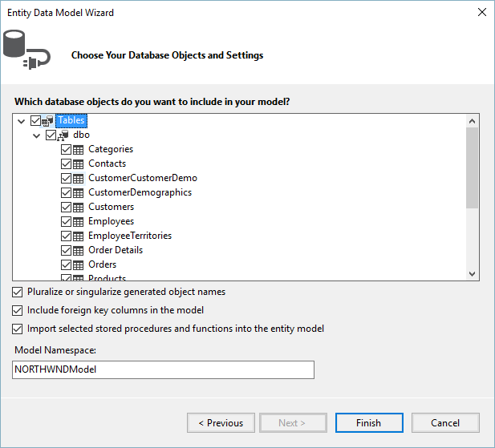

# Binding to EntityFramework using Database First Approach

This article demonstrates how to build a hierarchical grid by using Entity Framework and Database first approach.



## Installing and Configuring Entity Framework

In order to download Entity Framework you can follow this MSDN article - [Get Entity Framework](http://msdn.microsoft.com/en-us/data/ee712906.aspx). If you are using Visual Studio version below 2012 you may need to install the NuGet package manager - [Installing NuGet](http://docs.nuget.org/docs/start-here/installing-nuget)

After you have installed Entity Framework, follow these steps:

1\. Right-click on your Project in Visual Studio and choose Add >> New Item.
            


2\. Choose ADO.NET Entity Data Model
            


3\. From the next window choose *Generate From Database* and Click next.
            

4\. Choose your Database and click Next.
            


5\. From this final window select the needed tables and click Finish.
            


Now, our models should be generated.        

## Configure RadGridView to work with EntityFramework

1\. Add **RadGridView** to the **Form** and then in the code behind add an instance of the **DbContext** which will provide us access to the data in the database:

{{source=..\SamplesCS\GridView\PopulatingWithData\BindingToEntityFrameworkDatabaseFirst.cs region=addDbContext}} 
{{source=..\SamplesVB\GridView\PopulatingWithData\BindingToEntityFrameworkDatabaseFirst.vb region=addDbContext}} 

````C#
NorthwindEntities dbContext = new NorthwindEntities();

````
````VB.NET
Dim dbContext As New NorthwindEntities

````

{{endregion}} 

>note When binding **RadGridView** we will be using the Local property of **DbSet**. The Local property provides access to the data without a query being sent to the database. It is also synchronized with the **DbSet**. For example, if an entry is deleted from the Local property, the next time a query is executed it will be deleted from the database.
>

2\. Add the following code to your Form’s constructor:

{{source=..\SamplesCS\GridView\PopulatingWithData\BindingToEntityFrameworkDatabaseFirst.cs region=addDataSource}} 
{{source=..\SamplesVB\GridView\PopulatingWithData\BindingToEntityFrameworkDatabaseFirst.vb region=addDataSource}} 

````C#
dbContext.Customers.Load();
this.radGridView1.DataSource = this.dbContext.Customers.Local.ToBindingList();

````
````VB.NET
dbContext.Customers.Load()
Me.radGridView1.DataSource = Me.dbContext.Customers.Local.ToBindingList()

````

{{endregion}} 
 
These extension methods are located in the __System.Data.Entity__ namespace. As the **Local** property represents the local data, we need to first load the data from the database. Then, by calling __ToBindingList__ method we make sure that our **RadGridView** and the **Local** data will be synchronized.

>note When adding new rows in **RadGridView** by default the *Id* cell of the new rows will be *0* since the data was not send to the database, therefore no *UniqueId* has been assigned yet.
>


3\. Now, we just need to add the relation between the **Customers** and **Orders** tables:

{{source=..\SamplesCS\GridView\PopulatingWithData\BindingToEntityFrameworkDatabaseFirst.cs region=addRelation}} 
{{source=..\SamplesVB\GridView\PopulatingWithData\BindingToEntityFrameworkDatabaseFirst.vb region=addRelation}} 

````C#
dbContext.Orders.Load();
GridViewTemplate template = new GridViewTemplate();
template.DataSource = dbContext.Orders.Local.ToBindingList();
this.radGridView1.MasterTemplate.Templates.Add(template);
GridViewRelation relation = new GridViewRelation(this.radGridView1.MasterTemplate);
relation.ChildTemplate = template;
relation.RelationName = "CustomersToOrders";
relation.ParentColumnNames.Add("CustomerId");
relation.ChildColumnNames.Add("CustomerId");
this.radGridView1.Relations.Add(relation);

````
````VB.NET
dbContext.Orders.Load()
Dim template As New GridViewTemplate()
template.DataSource = dbContext.Orders.Local.ToBindingList()
Me.radGridView1.MasterTemplate.Templates.Add(template)
Dim relation As New GridViewRelation(Me.radGridView1.MasterTemplate)
relation.ChildTemplate = template
relation.RelationName = "CustomersToOrders"
relation.ParentColumnNames.Add("CustomerId")
relation.ChildColumnNames.Add("CustomerId")
Me.radGridView1.Relations.Add(relation)

````

{{endregion}} 

4\. The final step is to save the changes to the database when the form closes. For this purpose, we need to subscribe to the form's __Closing__ event and add the following code in the event handler:

{{source=..\SamplesCS\GridView\PopulatingWithData\BindingToEntityFrameworkDatabaseFirst.cs region=saveChanges}} 
{{source=..\SamplesVB\GridView\PopulatingWithData\BindingToEntityFrameworkDatabaseFirst.vb region=saveChanges}} 

````C#
this.dbContext.SaveChanges();

````
````VB.NET
Me.dbContext.SaveChanges()

````

{{endregion}} 

Now, if you run your application you should see the hierarchical data.

# See Also
* [Bind to XML]()

* [Bindable Types]()

* [Binding to a Collection of Interfaces]()

* [Binding to Array and ArrayList]()

* [Binding to BindingList]()

* [Binding to DataReader]()

* [Binding to Generic Lists]()

* [Binding to ObservableCollection]()

* [How to Bind GridView to a Local SQL Server]()

