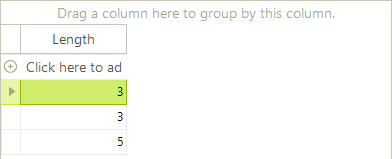
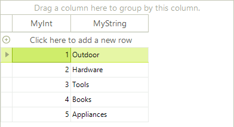

# Binding to Generic Lists

## Binding to Lists of Simple Types

Generally, you should not try to bind __RadGridView__ to a list of simple types. __RadGridView__ internally creates columns and reads data for the properties of the objects it is bound to. However, the integer type, for example does not have any properties so if you try to bind __RadGridView__ to a List of integers, you will get no data. Following the same logic, if you bind __RadGridView__ to a collection of strings, you will get a column representing the length of these strings, because the only property of a string object is the __Length__ property.

<snippet id='gridview-bindingtogenericlists-bindingtolistofsimpletypes-cs' />
<snippet id='gridview-bindingtogenericlists-bindingtolistofsimpletypes-vb' />

## Binding to Lists of Objects

Generic Lists of objects containing [bindable types]() can be bound to **RadGridView** by assigning the List to the __DataSource__ property of the grid. 

The example below defines a `MyObject` class containing one integer and one string property. The next set of code snippets "Creating an List of Objects" creates an array of MyObjects, initializes the array and assigns the array to the __DataSource__. The `MyObject` class would typically be placed in its own separate class file and the List creation, initialization and assignment code might be placed in a form's **Load** event handler.

<snippet id='gridview-bindingtogenericlists-objectclass-cs' />
<snippet id='gridview-bindingtogenericlists-objectclass-vb' />
<snippet id='gridview-bindingtogenericlists-bindingtoobjectsofsimpletype-cs' />
<snippet id='gridview-bindingtogenericlists-bindingtoobjectsofsimpletype-vb' />

# See Also
* [Bind to XML]()

* [Bindable Types]()

* [Binding to a Collection of Interfaces]()

* [Binding to Array and ArrayList]()

* [Binding to BindingList]()

* [Binding to DataReader]()

* [Binding to EntityFramework using Database first approach]()

* [Binding to ObservableCollection]()

