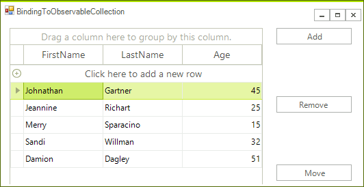
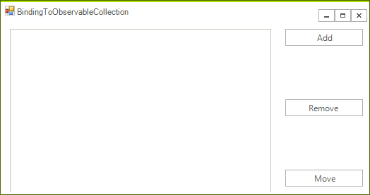

# Binding to ObservableCollection

The example bellow demonstrates how to bind __RadGridView__ to an `ObservableCollection`. This collection represents a dynamic data collection that provides notification when changes (add, move, remove) occur.
        

>note This collection is available in .NET version 4.0 and above. For this reason it is only supported in the .NET4.0 version of our assemblies (the ones with suffix .40), so please make sure to use those in order to take advantage of this functionality.
>

The example creates an `ObservableCollection` of `Person`, initializes the collection and assigns it to the grid's __DataSource__ property. There are also three buttons allowing the user to add, remove and move items from and in the collection. The changes in the collection are automatically reflected by the grid.

1\. First place a RadGridView and 3 buttons on a blank form. Name the buttons accordingly:

2\. Add the following sample class to the project:

<snippet id='gridview-bindingtoobservablecollection-sampleclass-cs' />
<snippet id='gridview-bindingtoobservablecollection-sampleclass-vb' />

3\. Define the collection along with the function that initializes it:

<snippet id='gridview-bindingtoobservablecollection-collection-cs' />
<snippet id='gridview-bindingtoobservablecollection-collection-vb' />

4\. Add the following event handlers for the buttons:

<snippet id='gridview-bindingtoobservablecollection-add-cs' />
<snippet id='gridview-bindingtoobservablecollection-add-vb' />
<snippet id='gridview-bindingtoobservablecollection-remove-cs' />
<snippet id='gridview-bindingtoobservablecollection-remove-vb' />
<snippet id='gridview-bindingtoobservablecollection-move-cs' />
<snippet id='gridview-bindingtoobservablecollection-move-vb' />

5\. Finally just call the __InitializeCollection__ method to populate the collection and bind the __RadGridView__ to it

<snippet id='gridview-bindingtoobservablecollection-binding-cs' />
<snippet id='gridview-bindingtoobservablecollection-binding-vb' />

Now each change you introduce to the collection by pressing the buttons will be automatically reflected in __RadGridView__.
        
# See Also
* [Bind to XML]()

* [Bindable Types]()

* [Binding to a Collection of Interfaces]()

* [Binding to Array and ArrayList]()

* [Binding to BindingList]()

* [Binding to DataReader]()

* [Binding to EntityFramework using Database first approach]()

* [Binding to Generic Lists]()

