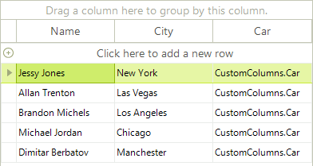
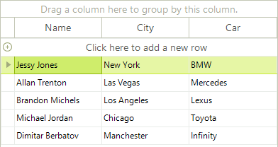

# Binding to Sub Objects

RadGridView supports out-of-the-box binding to sub objects by intuitive and simple __dot (.)__ syntax (specified through the __FieldName__ property of declaratively bound columns). The example below includes a "Person" class that has three properties, one of which is a reference type "Car":

* Name - string

* City - string

* Car - object Car

Follows the implementation of the Person and the Car classes:

#### Defining the Class and Sub Class

<snippet id='gridview-bindingtosubobjects-classes-cs' />
<snippet id='gridview-bindingtosubobjects-classes-vb' />

Lets populate a `BindingList` of `Person` with some objects and bind it to RadGridView.

Binding RadGridView to `Person` automatically creates three columns for all properties of the `Person` object. The value properties are displayed correctly, but the reference property is displayed in "dot" notation (see the third (Car) column in the screenshot below).

<snippet id='gridview-bindingtosubobjects-bindradgridview-cs' />
<snippet id='gridview-bindingtosubobjects-bindradgridview-vb' />

Now to setup the sub-property binding of the `Car` column, all you have to do is to declare in the __FieldName__ property of the column, the name of the Car object property that you want to bind the column to (Model or Year), using the __dot__ notation:

<snippet id='gridview-bindingtosubobjects-addsubpropertybinding-cs' />
<snippet id='gridview-bindingtosubobjects-addsubpropertybinding-vb' />

The result is that the `Car` column is now bound to the __Model__ property of the `Car` object

# See Also
* [Bind to XML]()

* [Bindable Types]()

* [Binding to a Collection of Interfaces]()

* [Binding to Array and ArrayList]()

* [Binding to BindingList]()

* [Binding to DataReader]()

* [Binding to EntityFramework using Database first approach]()

* [Binding to Generic Lists]()

