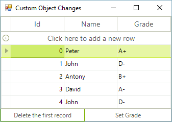
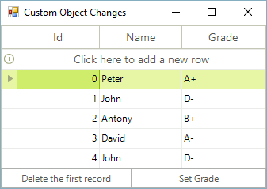
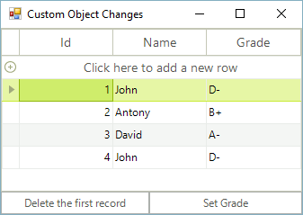
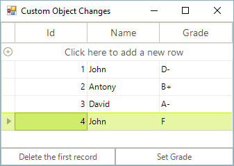

# Reflecting Custom Object Changes in RGV

RadGridView is capable of fetching bindable properties and data. However, one important issue must be noted: during the data binding process, the grid extracts the data from the data source, but for any later changes in the data source, RadGridView should be notified. Your bindable collection and business objects should follow some standards established in .NET in order to notify RadGridView about the changes:

*  The collection that you will bind to RadGridView should implement `IBindingList` or `IBindingListView` interfaces. This will allow RadGridView to get notified about insert and delete operations of records.
            

* Your business objects should implement `INotifyPropertyChanged` interface (.NET 2.0). This will allow RadGridView to reflect changes which occur to the properties of the business objects.
            
We will not only analyze the correct case that you should follow, but we will also analyze the cases where incorrect collections or business object implementations are used. This will allow you to understand what you can expect from RadGridView in the various cases.
      

## Binding to non-IBindingList collections containing objects that do not implement INotifyPropertyChanged

Before observing what will happen if we bind to an `IBindingList` collection, let's see what will actually happen if we bind RadGridView to a collection of a wrong type.
          
Such a collection is List. Although it is a generic collection and it is convenient for storing a number of business objects, it does not support the two-way binding mechanism needed for the purposes of the notifications.
          
Here are the steps for this scenario:

1\.  Create a class called `Student`:

<snippet id='gridview-student-student-cs' />
<snippet id='gridview-student-student-vb' />

2\. Fill a `List` with several `Students` and bind it to RadGridView:

<snippet id='gridview-reflectingcustomobjectchanges-list-cs' />
<snippet id='gridview-reflectingcustomobjectchanges-list-vb' />

3\. On a button click, remove the first `Student` from the collection:

<snippet id='gridview-reflectingcustomobjectchanges-buttonremove-cs' />
<snippet id='gridview-reflectingcustomobjectchanges-buttonremove-vb' />

The initial view when we start the application is this:

 

What will happen after we press the button once? We will have the same view:

RadGridView is not synchronized, simply because nothing notifies it about the change in the collection.
        

## Binding to IBindingList collections containing objects that do not implement INotifyPropertyChanged

Let's now bind RadGridView to a collection that implements `IBindingList`. A very popular and appropriate collection that implements `IBindingList` is `BindingList`. Here, we will not only analyze how RadGridView behaves in relation to the bound collection, but we will also check why the implementation of `INotifyPropertyChanged` does matter. Here are the steps for this scenario:

1\. Create a class called `Student`. This class will be the same as the class in the previous section, so we will not post the implementation here.

2\. Fill a `BindingList` with several `Students` and bind it to RadGridView:

<snippet id='gridview-reflectingcustomobjectchanges-bindinglist-cs' />
<snippet id='gridview-reflectingcustomobjectchanges-bindinglist-vb' />

3\. On a button click, remove the first Student from the collection:

<snippet id='gridview-reflectingcustomobjectchanges-buttonremove-cs' />
<snippet id='gridview-reflectingcustomobjectchanges-buttonremove-vb' />

4\. On a button click of another button, change the `Grade` of the last `Student` in the collection to "F":

<snippet id='gridview-reflectingcustomobjectchanges-setgrade-cs' />
<snippet id='gridview-reflectingcustomobjectchanges-setgrade-vb' />

Let's now test this case. At the beginning we have this view:

After we press the button which removes the first record, we indeed get a RadGridView with four records in return. This is because RadGridView is bound to a collection that implements IBindingList:

Let's now press the other button in order to change the Grade of the last student in the collection. The result is shown below: 

 

You do not see a difference? This is normal and expected, because the type `Student` does not implement `INotifyPropertyChanged`, so the changes in the properties of the `Student` objects are not reflected in RadGridView.

## Binding to IBindingList collections containing objects that do implement INotifyPropertyChanged

This is the most valid case among the three described cases. Here, we are binding to a collection that implements `IBindingList` and which contains objects that implement `INotifyPropertyChanged`. Such combinations of objects notifies RadGridView for all changes, no matter whether a record is inserted/deleted or a property is changed in one of the objects that implement `INotifyPropertyChanged`. Here are the steps for this case:

1\. Create a class Student that implements `INotifyPropertyChanged`:

<snippet id='gridview-studentdynamic-student-cs' />
<snippet id='gridview-studentdynamic-student-vb' />

2\. Fill a BindingList collection with a few objects of type `Student` and bind RadGridView to it:

<snippet id='gridview-reflectingcustomobjectchanges-bindinglist-cs' />
<snippet id='gridview-reflectingcustomobjectchanges-bindinglist-vb' />

3\. On a button click, remove the first object in the collection:

<snippet id='gridview-reflectingcustomobjectchanges-buttonremove-cs' />
<snippet id='gridview-reflectingcustomobjectchanges-buttonremove-vb' />

4\. On a button click of another button, set the `Grade` of the last `Student` to "F":

<snippet id='gridview-reflectingcustomobjectchanges-setgrade-cs' />
<snippet id='gridview-reflectingcustomobjectchanges-setgrade-vb' />

Let's now test this case. At the beginning we have this view:

After we press the button which removes the first record, we indeed get a RadGridView with four records in return. This is because RadGridView is bound to a collection that implements IBindingList:

Let's now press the other button in order to change the Grade of the last student in the collection. The result is shown below:

As you can see RadGridView successfully reflects the change in the `Grade` property that we make. This is because of the improved `Student` object implements `INotifyPropertyChanged` and because of the `BindingList` that implements `IBindingList`.
        
# See Also
* [Bind to XML]()

* [Bindable Types]()

* [Binding to a Collection of Interfaces]()

* [Binding to Array and ArrayList]()

* [Binding to BindingList]()

* [Binding to DataReader]()

* [Binding to EntityFramework using Database first approach]()

* [Binding to Generic Lists]()

