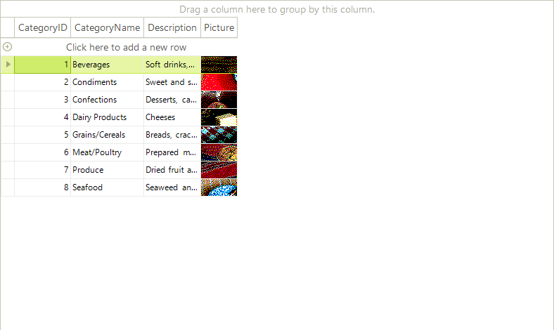
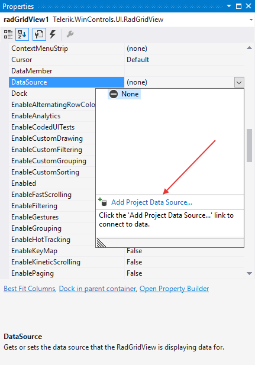
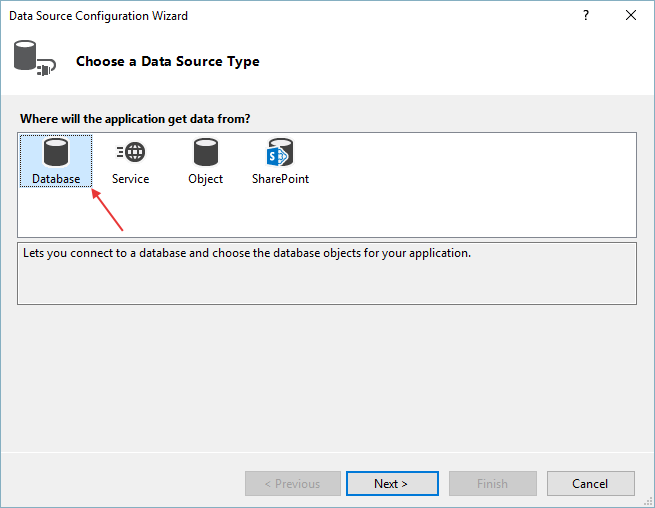
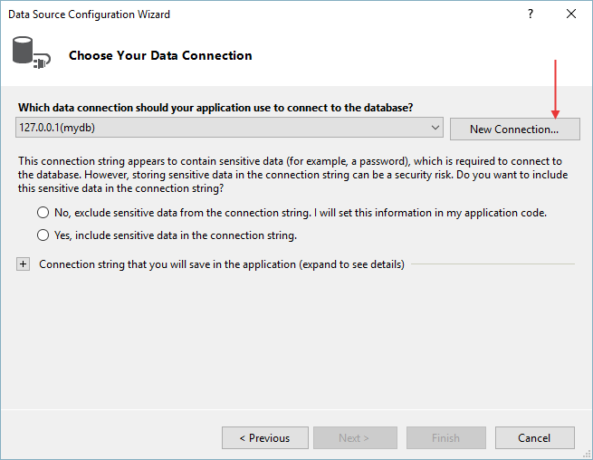
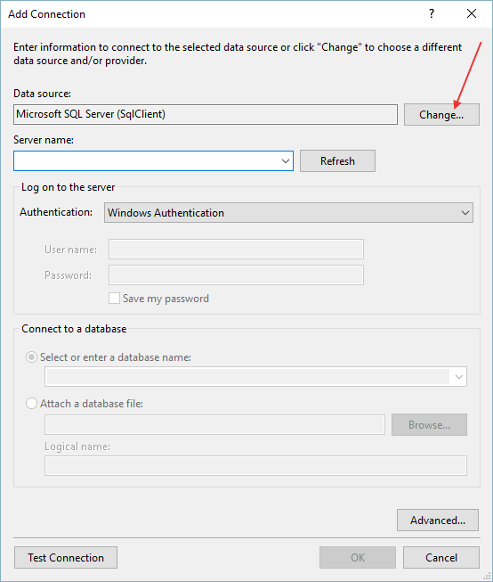
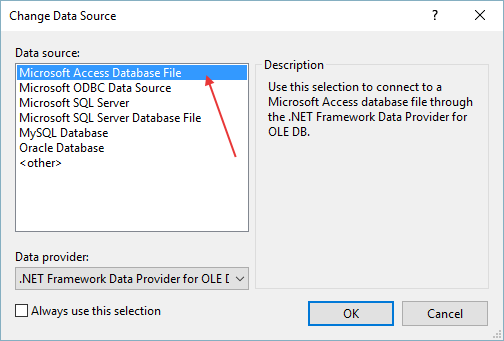
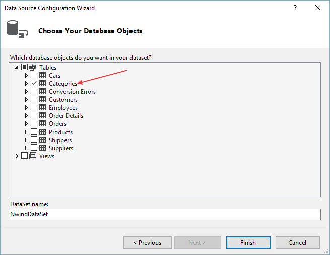
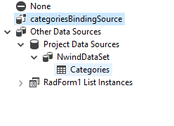
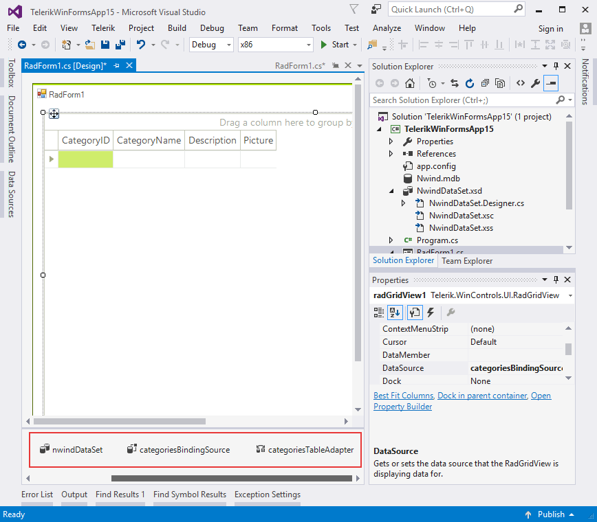

# Tutorial: Binding to DataTable or DataSet

The following tutorial demonstrates binding to a single database table. For information on binding to multiple tables see the [Binding to Hierarchical Data]() topic. 



1\. Place a **RadGridView** component on a form. Set the __Dock__ property to *Fill*.

2\. In the Properties window locate the __DataSource__ property and click the arrow to open the list. Select the __Add Project Data Source...__ link. *This step will display the Data Source Configuration Wizard.*



3\. In the `Data Source Configuration Wizard` __Choose a Data Source Type page__, select the __Database__ icon. Click the __Next__ button.



4\. In the `Choose Your data Connection` page click the __New Connection...__ button. *This step will display the Add Connection dialog.*

5\. In the `Add Connection` dialog click the __Change...__ button. This step will display the `Change Data Source dialog`.



6\. Select the __Microsoft Access Database File__ data source. Click the __OK__ button to close the `Change Data Source` dialog.



7\. The `Add Connection` dialog will appear. Click the Database File Name __Browse__ button and locate the "NWind.mdb" file from the Telerik UI for WinForms directory in the "\Examples\DataSources" directory. Click the __OK__ button to close the `Add Connection` dialog.
            

8\. In the `Choose Your Database Objects` page, select the __"Categories"__ table. Click the __Finish__ button to close the `Data Source Configuration Wizard`.



9\. In the Visual Studio Properties window for the grid __DataSource__ property select the __"Categories"__ table. *This step will create DataSet, BindingSource and TableAdapter objects for the categories table.*



10\. The project design should look something like the screenshot below. Note the new data components in the component tray under the design surface.



11\. Replace the Form_Load event handler with the following code. *The "foreach" code iterates all the columns in the grid and calls BestFit() so that the columns will expand to show the data*.

{{source=..\SamplesCS\GridView\PopulatingWithData\TutorialBindingToDataTableOrDataSet.cs region=bestFitColumns}} 
{{source=..\SamplesVB\GridView\PopulatingWithData\TutorialBindingToDataTableOrDataSet.vb region=bestFitColumns}} 

````C#
private void TutorialBindingToDataTableOrDataSet_Load(object sender, EventArgs e)
{
    this.categoriesTableAdapter.Fill(this.nwindDataSet.Categories);
    foreach (GridViewDataColumn column in radGridView1.Columns)
    {
        column.BestFit();
    }
}

````
````VB.NET
Private Sub TutorialBindingToDataTableOrDataSet_Load(ByVal sender As System.Object, ByVal e As System.EventArgs) Handles MyBase.Load
    Me.CategoriesTableAdapter.Fill(Me.NwindDataSet.Categories)
    For Each column As GridViewDataColumn In RadGridView1.Columns
        column.BestFit()
    Next
End Sub

````

{{endregion}} 

12\. Press __F5__ to run the application.
            
# See Also
* [Bind to XML]()

* [Bindable Types]()

* [Binding to a Collection of Interfaces]()

* [Binding to Array and ArrayList]()

* [Binding to BindingList]()

* [Binding to DataReader]()

* [Binding to EntityFramework using Database first approach]()

* [Binding to Generic Lists]()

