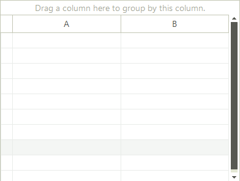
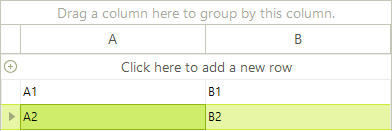

# Unbound Mode

When in unbound mode of RadGridView does not use a data source to generate its content. In this mode, you need to add/remove the grid columns and rows using the provided API or the __RadGridView__ user interface (in design-time). You can also have a spreadsheet-like grid with empty rows and columns, letting the user enter own data. This topic described the three possible scenarios for creating unbound grids:

* Creating empty grids with __RowCount__ property set to the number of desired rows

* Creating grids and filling them with data, using the __Cells__ collection

* Creating grids and filling them with data, using the __Rows__ collection

## Creating Empty Grid

You can create a grid with empty rows and columns and let the user fill the data. You should add columns to the __Columns__ collection of the corresponding __GridViewTemplate__ (or __RadGridView__ in cases of flat grid). Then you should set the __RowCount__ property to the number of desired rows. The grid does take into account the number of the rows that are already set (as described further in this topic). If you have explicitly set 5 rows and set __RowCount__ to 10, __RadGridView__ will add 5 more empty rows so that the total number will be 10. 

The following code demonstrates how to create a grid with two columns and ten rows: 

<snippet id='gridview-unboundmode-creatingemptygrid-cs' />
<snippet id='gridview-unboundmode-creatingemptygrid-vb' />

The result from the code above is on the screenshot below:

## Adding rows programmatically (through Cells collection)

In this scenario, you should add the data for each cell in the row, specifying the cell index or the column name. Note that you should first create the columns:

<snippet id='gridview-unboundmode-addingrowsthroughcellscollection-cs' />
<snippet id='gridview-unboundmode-addingrowsthroughcellscollection-vb' />

The code above results in the following grid:

## Adding rows programmatically (through Rows collection)

You can have the same result as the picture above by adding the rows data using the __Add__ method of the __Rows__ collection: 

<snippet id='gridview-unboundmode-addingrowsthroughrowscollection-cs' />
<snippet id='gridview-unboundmode-addingrowsthroughrowscollection-vb' />

## Hierarchical Grid in Unbound mode

Setting the hierarchical grid in unbound mode is quite similar to that for the bound mode with only difference is setting the unbound mode itself. First of all you need to create and the columns you need. After that set up the relation and finally load the data.

<snippet id='gridview-unboundmode-creatinghierarchicalgridinunboundmode-cs' />
<snippet id='gridview-unboundmode-creatinghierarchicalgridinunboundmode-vb' />

# See Also
* [Bind to XML]()

* [Bindable Types]()

* [Binding to a Collection of Interfaces]()

* [Binding to Array and ArrayList]()

* [Binding to BindingList]()

* [Binding to DataReader]()

* [Binding to EntityFramework using Database first approach]()

* [Binding to Generic Lists]()

