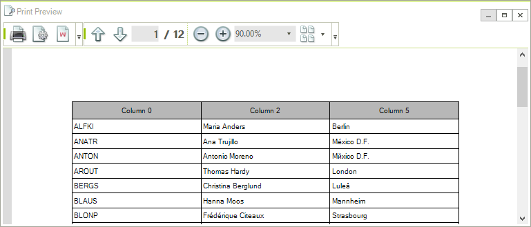
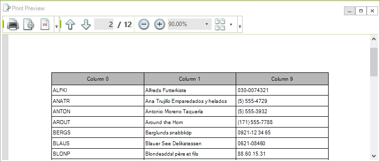
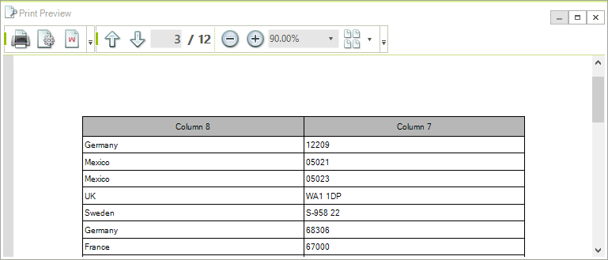
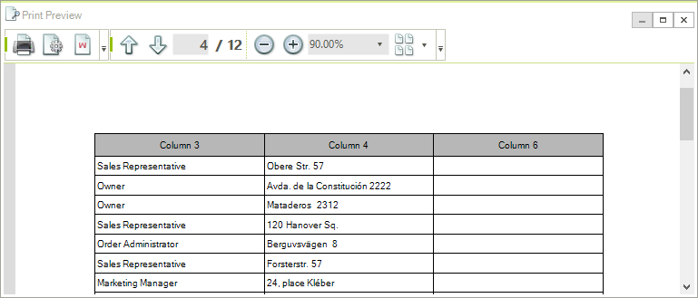

# GridPrintStyle

You can customize the settings of the grid print job by setting the __PrintStyle__ property of the RadGridView to a new instance of the __GridPrintStyle__ class or editing the current one. The available properties are:

* __CellFont_: Gets or sets the font that will be used for the cells.

* __GroupRowFont__: Gets or sets the font that will be used for the group cells.

* __HeaderCellFont__: Gets or sets the font that will be used for the header cells.

* __SummaryCellFont__: Gets or sets the font that will be used for the summary cells.
 
* __HierarchyIndent__: Gets or sets a indent in pixels when printing a hierarchicle grid.

* __PrintGrouping:__ Determines if grouping will be printed.

* __PrintSummaries:__ Determines if summary rows will be printed.

* __PrintHiddenRows__: Gets or sets a value indicating whether hidden rows will be printed.

* __PrintHiddenRows:__ Determines if hidden rows will be printed.

* __PrintHiddenColumns:__ Determines if hidden columns will be printed.

* __PrintAlternatingRowColor__: Gets or sets a value indicating whether alternating row color is printed.

* __PrintHeaderOnEachPage:__ Determines if header cells will be printed on each page.

* __PrintAllPages__: Gets or sets a value indicating whether all pages will be printed when paging is enabled.

* __CellBackColor__: Gets or sets the default back color for data cells.

* __HeaderCellBackColor__: Gets or sets the default back color of header cells.

* __GroupRowBackColor__: Gets or sets the default back color of group rows.

* __SummaryCellBackColor__: Gets or sets the default back color of summary cells.

* __AlternatingRowColor__: Gets or sets a value indidcating the alternating row color for odd rows.

* __BorderColor__: Gets or sets the default color of all borders.

* __CellPadding__: Gets or sets the default padding for all cells.

* __FitWidthMode:__ Determines how the RadGridView will be positioned on the page. There are three possible settings for this property:

    * NoFit – the grid is aligned to the left and its size is not changed

    * NoFitCentered – the grid is center aligned and its size is not changed

    * FitPageWidth – the grid is resized, keeping the columns width ratios, so it would fill the whole page.

    * You can also set the header cells font, data cells font, group cells font and summary cells font.
	
* __ChildViewPrintMode__: Gets or sets a value indicating how child views are printed when printing a hierarchical grid.

	* PrintFirstView - Always prints the first view.
	
	* PrintCurrentlyActiveView - Prints the view that is active in the grid.
	
	* SelectViewToPrint - In this mode the ChildViewPrinting event is fired. The event allows to choose the view to export on a row by row basis.
	
* __GridView__: Gets the <see cref="RadGridView"/> that this print styles is assigned to.

* __PrintTraverser__: Gets the traverser that is used to traverse the RadGridView.

* __PrintRenderer__: Gets or sets the print renderer that is used for print rendering.
	
## Customizing GridPrintStyle

{{source=..\SamplesCS\GridView\Printing support\GridPrintStyle1.cs region=PrintStyle}} 
{{source=..\SamplesVB\GridView\Printing support\GridPrintStyle1.vb region=PrintStyle}} 

````C#
GridPrintStyle style = new GridPrintStyle();
style.FitWidthMode = PrintFitWidthMode.FitPageWidth;
style.PrintGrouping = true;
style.PrintSummaries = false;
style.PrintHeaderOnEachPage = true;
style.PrintHiddenColumns = false;
this.radGridView1.PrintStyle = style;
this.radGridView1.Print();

````
````VB.NET
Dim style As New GridPrintStyle()
style.FitWidthMode = PrintFitWidthMode.FitPageWidth
style.PrintGrouping = True
style.PrintSummaries = False
style.PrintHeaderOnEachPage = True
style.PrintHiddenColumns = False
Me.RadGridView1.PrintStyle = style
Me.RadGridView1.Print()

````

{{endregion}} 


## Multi-page printing

Multi-page printing is supported for grids with ViewDefinition set to TableViewDefinition. To enable the functionality you should define the collection of columns each page will contain. For this purpose you can use the PrintPages collection of the TableViewDefinitionPrintRenderer. The PrintPages collection contains collections of columns, each representing a separate page. Here is an example which assumes the grid has 10 columns:

{{source=..\SamplesCS\GridView\Printing support\GridPrintStyle1.cs region=MultiPagePrintingPrintStyle}} 
{{source=..\SamplesVB\GridView\Printing support\GridPrintStyle1.vb region=MultiPagePrintingPrintStyle}} 

````C#
GridPrintStyle printStyle = new GridPrintStyle(this.radGridView1);
TableViewDefinitionPrintRenderer renderer = new TableViewDefinitionPrintRenderer(this.radGridView1);
renderer.PrintPages.Add(this.radGridView1.Columns[0], this.radGridView1.Columns[2], this.radGridView1.Columns[5]);
renderer.PrintPages.Add(this.radGridView1.Columns[0], this.radGridView1.Columns[1], this.radGridView1.Columns[9]);
renderer.PrintPages.Add(this.radGridView1.Columns[8], this.radGridView1.Columns[7]);
renderer.PrintPages.Add(this.radGridView1.Columns[3], this.radGridView1.Columns[4], this.radGridView1.Columns[6]);
printStyle.PrintRenderer = renderer;
this.radGridView1.PrintStyle = printStyle;

````
````VB.NET
Dim printStyle As GridPrintStyle = New GridPrintStyle(RadGridView1)
Dim renderer As TableViewDefinitionPrintRenderer = New TableViewDefinitionPrintRenderer(RadGridView1)
renderer.PrintPages.Add(RadGridView1.Columns(0), RadGridView1.Columns(2), RadGridView1.Columns(5))
renderer.PrintPages.Add(RadGridView1.Columns(0), RadGridView1.Columns(1), RadGridView1.Columns(9))
renderer.PrintPages.Add(RadGridView1.Columns(8), RadGridView1.Columns(7))
renderer.PrintPages.Add(RadGridView1.Columns(3), RadGridView1.Columns(4), RadGridView1.Columns(6))
printStyle.PrintRenderer = renderer
RadGridView1.PrintStyle = printStyle
RadGridView1.PrintPreview()

````

{{endregion}} 

This code defines four pages where the content of the pages is as follows:

* Page 1 will contain the grid columns at indexes 0, 2 and 5.
            

* Page 2 will contain the grid columns at indexes 0, 1 and 9.
            

* Page 3 will contain the grid columns at indexes 8 and 7.
            

* Page 4 will contain the grid columns at indexes 3, 4 and 6.

You should note that one column can appear on several pages. Here is the result of the above code when previewed in the PrintPreviewDialog:









## See Also
* [Events and Customization]()

* [Printing Hierarchical Grid]()

* [Overview]()

