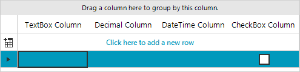
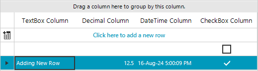
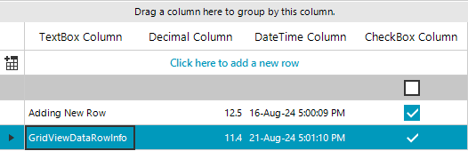
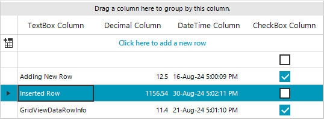

# Adding and Inserting Rows

When **RadGridView** is in unbound mode, you can add new rows to the **Rows** collection.

## Adding rows to RadGridView

For example, if the grid control contains four columns – [GridViewTextBoxColumn](), [GridViewDecimalColumn](), [GridViewDateTimeColumn]() and [GridViewCheckBoxColumn]() you can add an empty row as it is demonstrated in the code snippet below.
      	
The RadGridView.Rows.__AddNew()__ method adds an empty row and allows the user to enter a value for each column cells’:

#### Add an empty row

{{source=..\SamplesCS\GridView\Rows\AddingAndInsertingRows.cs region=addNewRow}} 
{{source=..\SamplesVB\GridView\Rows\AddingAndInsertingRows.vb region=addNewRow}} 

````C#
radGridView1.Rows.AddNew();

````
````VB.NET
RadGridView1.Rows.AddNew()

````

{{endregion}} 

>caption Figure 1: Add a blank new row.



The RadGridView.Rows.__Add(value-for-first-column, value-for-second-column, value-for-third-column)__ method adds a new row with the specified values. You can use the following code snippet to add values for each column:

#### Add a new row with values

{{source=..\SamplesCS\GridView\Rows\AddingAndInsertingRows.cs region=addRow}} 
{{source=..\SamplesVB\GridView\Rows\AddingAndInsertingRows.vb region=addRow}} 

````C#
radGridView1.Rows.Add("Adding New Row", 12.5, DateTime.Now, true);

````
````VB.NET
RadGridView1.Rows.Add("Adding New Row", 12.5, DateTime.Now, True)

````

{{endregion}} 

>caption Figure 2: Add new row with data in it.



You can also add rows by creating an instance of __GridViewDataRowInfo__ and adding it to the __Rows__ collection of __RadGridView__:

#### Add a GridViewDataRowInfo

{{source=..\SamplesCS\GridView\Rows\AddingAndInsertingRows.cs region=addRowWithRowInfo}} 
{{source=..\SamplesVB\GridView\Rows\AddingAndInsertingRows.vb region=addRowWithRowInfo}} 

````C#
GridViewDataRowInfo rowInfo = new GridViewDataRowInfo(this.radGridView1.MasterView);
rowInfo.Cells[0].Value = "GridViewDataRowInfo";
rowInfo.Cells[1].Value = 11.4;
rowInfo.Cells[2].Value = DateTime.Now.AddDays(5);
rowInfo.Cells[3].Value = true;
radGridView1.Rows.Add(rowInfo);

````
````VB.NET
Dim rowInfo As New GridViewDataRowInfo(Me.RadGridView1.MasterView)
rowInfo.Cells(0).Value = "GridViewDataRowInfo"
rowInfo.Cells(1).Value = 11.4
rowInfo.Cells(2).Value = DateTime.Now.AddDays(5)
rowInfo.Cells(3).Value = True
RadGridView1.Rows.Add(rowInfo)

````

{{endregion}} 

>caption Figure 3: Add new row by creating an instance first.



## Inserting rows in RadGridView

Rows can be inserted at a specified position by using the __Insert__ method of the __Rows__ collection. Below you can see an example of this functionality:

#### Insert a GridViewDataRowInfo

{{source=..\SamplesCS\GridView\Rows\AddingAndInsertingRows.cs region=insertRow}} 
{{source=..\SamplesVB\GridView\Rows\AddingAndInsertingRows.vb region=insertRow}} 

````C#
GridViewDataRowInfo dataRowInfo = new GridViewDataRowInfo(this.radGridView1.MasterView);
dataRowInfo.Cells[0].Value = "Inserted Row";
dataRowInfo.Cells[1].Value = 1156.54;
dataRowInfo.Cells[2].Value = DateTime.Now.AddDays(14);
radGridView1.Rows.Insert(2, dataRowInfo);

````
````VB.NET
Dim dataRowInfo As New GridViewDataRowInfo(Me.RadGridView1.MasterView)
rowInfo.Cells(0).Value = "Inserted Row"
rowInfo.Cells(1).Value = 1154.54
rowInfo.Cells(2).Value = DateTime.Now.AddDays(14)
RadGridView1.Rows.Insert(2, dataRowInfo)

````

{{endregion}} 

>caption Figure 4: Insert row to a specific position.



# See Also
* [Conditional Formatting Rows]()

* [Creating custom rows]()

* [Drag and Drop]()

* [Formatting Rows]()

* [GridViewRowInfo]()

* [Iterating Rows]()

* [New Row]()

* [Painting Rows]()

