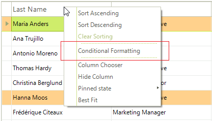

# Conditional Formatting Rows

Cells and rows can be styled based on data conditions using the __ConditionalFormattingObject__. Setup the condition in the constructor for the __ConditionalFormattingObject__. The constructor parameters are:

* The name of the condition. 

* A __ConditionTypes__ enumeration value: Equal, NotEqual, StartsWith, EndsWith, Contains, DoesNotContain, Greater, GreaterOrEqual, Less, LessOrEqual, Between, NotBetween.

* A string for the first value used to test the condition.

* A string for the second value used to test the condition.

* An "ApplyToRow" boolean that if true allows you to format the entire row that the cell appears in.

The __ConditionalFormattingObject__ also contains formatting properties for the cell, row and text alignment. 

* __CellBackColor:__ Sets the background color for the cell.
        

* __CellForeColor:__ Sets the cell text font color.
        

* __CellFont:__ Sets the cell text font.
        

* __RowBackColor:__ Sets the background color for the entire row that the cell appears in.
        

* __RowForeColor:__ Sets the cell text font color for the entire row that the cell appears in.
        

* __RowFont:__ Sets the cell text font for the entire row that the cell appears in.
        

* __TextAlignment__ is a __ContentAlignment__ enumeration value that can be __TopLeft__, __TopCenter__, __TopRight__, __MiddleLeft__, __MiddleCenter__, __MiddleRight__, __BottomLeft__, __BottomCenter__ and __BottomRight__.

## Conditional Formatting Rows

This example looks for the same condition as the [cell formatting example](). The difference is that the last parameter ("ApplyToRow") passed to the __ConditionalFormattingObject__ is set to *true*, allowing the __RowBackColor__ property to be recognized.


{{source=..\SamplesCS\GridView\Rows\ConditionalFormattingRows.cs region=conditionalFormatting}} 
{{source=..\SamplesVB\GridView\Rows\ConditionalFormattingRows.vb region=conditionalFormatting}} 

````C#
ConditionalFormattingObject obj = new ConditionalFormattingObject("MyCondition", ConditionTypes.Greater, "30", "", true);
obj.CellForeColor = Color.Red;
obj.RowBackColor = Color.SkyBlue;
this.radGridView1.Columns["UnitPrice"].ConditionalFormattingObjectList.Add(obj);

````
````VB.NET
Dim obj = New ConditionalFormattingObject("MyCondition", ConditionTypes.Greater, "30", "", True)
obj.CellForeColor = Color.Red
obj.RowBackColor = Color.SkyBlue
Me.RadGridView1.Columns("Unit Price").ConditionalFormattingObjectList.Add(obj)

````

{{endregion}} 


>caution The declarative nature of Conditional Formatting limits the situations in which it can be used. While the provided functionality covers most scenarios, there are situations in which you will need to use [events]().
>

**RadGridView** provides a convenient form which the end user could use to create formatting objects. You can show the form by using the header cells' context menu. To access and customize the dialog, you can use the **ConditionalFormattingFormShown** event. :




# See Also
* [Adding and Inserting Rows]()

* [Creating custom rows]()

* [Drag and Drop]()

* [Formatting Rows]()

* [GridViewRowInfo]()

* [Iterating Rows]()

* [New Row]()

* [Painting Rows]()

