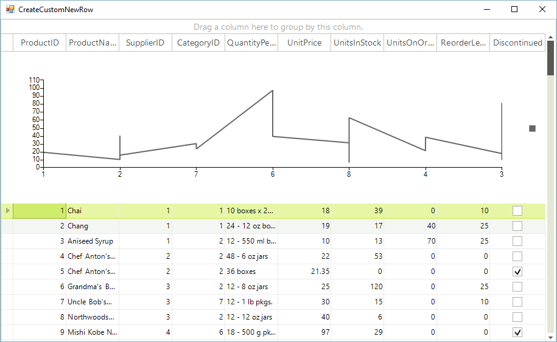

# Creating custom rows

__RadGridView__ provides a variety of visual cells per row with different functionality and purpose. However, in some cases you may need to display custom elements, not a single cell per column. This article demonstrates a sample approach how to create a custom row element.

## Custom new row

Consider the __RadGridView__ is populated with data form Northwind.Products table. 

{{source=..\SamplesCS\GridView\Rows\CreateCustomNewRow.cs region=PopulateData}} 
{{source=..\SamplesVB\GridView\Rows\CreateCustomNewRow.vb region=PopulateData}} 

````C#
public static object DataSource;
private void CreateCustomNewRow_Load(object sender, EventArgs e)
{
    this.productsTableAdapter.Fill(this.nwindDataSet.Products);
    DataSource = this.nwindDataSet.Products.Take(20);
 
    this.radGridView1.TableElement.ViewInfo.TableAddNewRow.Height = 250;
    this.radGridView1.DataSource = this.nwindDataSet.Products;
    this.radGridView1.AutoSizeColumnsMode = Telerik.WinControls.UI.GridViewAutoSizeColumnsMode.Fill;
}

````
````VB.NET
Public Shared DataSource As Object
Private Sub CreateCustomNewRow_Load(sender As Object, e As EventArgs) Handles MyBase.Load
    Me.ProductsTableAdapter.Fill(Me.NwindDataSet.Products)
    DataSource = Me.NwindDataSet.Products.Take(20)
    Me.RadGridView1.TableElement.ViewInfo.TableAddNewRow.Height = 250
    Me.RadGridView1.DataSource = Me.NwindDataSet.Products
    Me.RadGridView1.AutoSizeColumnsMode = Telerik.WinControls.UI.GridViewAutoSizeColumnsMode.Fill
End Sub

````

{{endregion}} 

>note In order to enlarge the new row's height, you can set the TableElement.ViewInfo.TableAddNewRow. __Height__ property.
>


On the new row we will display a __RadChartViewElement__ visualizing the Products data. For this purpose we should follow the steps below:

>note You can replace the __RadChartViewElement__ with any __RadElement__ or a set of elements.
>

>caption Figure 1: The new row is replaced with the custom one. 



1\. Create a descendant of the __GridRowElement__ and override its __CreateChildElements__ where you should add a single __GridCellElement__ that contains the chart. The __IsCompatible__ method  determines for which __GridViewRowInfo__ the custom row element is applicable:

{{source=..\SamplesCS\GridView\Rows\CreateCustomNewRow.cs region=RowElement}} 
{{source=..\SamplesVB\GridView\Rows\CreateCustomNewRow.vb region=RowElement}} 

````C#
public class CustomGridRowElement : GridRowElement
{
    private GridCellElement cellElement;
    private RadChartElement radChartElement;
    
    public CustomGridRowElement()
    {
    }
        
    protected override void CreateChildElements()
    {
        base.CreateChildElements();
        this.cellElement = new GridCellElement(null, this);
        this.cellElement.StretchHorizontally = true;
        this.cellElement.StretchVertically = true;
        this.Children.Add(cellElement);
        
        this.radChartElement = new RadChartElement();
        
        LineSeries series = new LineSeries();
        
        this.radChartElement.View.ShowSmartLabels = true;
        this.radChartElement.ShowLegend = true;
        this.radChartElement.View.Series.Add(series);
        this.cellElement.Children.Add(this.radChartElement);
        this.cellElement.ClipDrawing = true;
        
        series.CategoryMember = "CategoryID";
        series.ValueMember = "UnitPrice";
        series.DataSource = DataSource;
    }
        
    public override bool IsCompatible(GridViewRowInfo data, object context)
    {
        return data is CustomGridViewRowInfo;
    }
}

````
````VB.NET
Public Class CustomGridRowElement
    Inherits GridRowElement
    Private cellElement As GridCellElement
    Private radChartElement As RadChartElement
    Public Sub New()
    End Sub
    Protected Overrides Sub CreateChildElements()
        MyBase.CreateChildElements()
        Me.cellElement = New GridCellElement(Nothing, Me)
        Me.cellElement.StretchHorizontally = True
        Me.cellElement.StretchVertically = True
        Me.Children.Add(cellElement)
        Me.radChartElement = New RadChartElement()
        Dim series As New LineSeries()
        Me.radChartElement.View.ShowSmartLabels = True
        Me.radChartElement.ShowLegend = True
        Me.radChartElement.View.Series.Add(series)
        Me.cellElement.Children.Add(Me.radChartElement)
        Me.cellElement.ClipDrawing = True
        series.CategoryMember = "CategoryID"
        series.ValueMember = "UnitPrice"
        series.DataSource = DataSource
    End Sub
    Public Overrides Function IsCompatible(data As GridViewRowInfo, context As Object) As Boolean
        Return TypeOf data Is CustomGridViewRowInfo
    End Function
End Class

````

{{endregion}} 

2\. Create a descendant of the __GridViewNewRowInfo__ and specify that it uses the row element from the previous step by overriding its __RowElementType__ property.

{{source=..\SamplesCS\GridView\Rows\CreateCustomNewRow.cs region=RowInfo}} 
{{source=..\SamplesVB\GridView\Rows\CreateCustomNewRow.vb region=RowInfo}} 

````C#
    
public class CustomGridViewRowInfo : GridViewNewRowInfo
{
    public CustomGridViewRowInfo(GridViewInfo viewInfo) : base(viewInfo)
    {
    }
        
    public override Type RowElementType
    {
        get
        {
            return typeof(CustomGridRowElement);
        }
    }
}

````
````VB.NET
Public Class CustomGridViewRowInfo
    Inherits GridViewNewRowInfo
    Public Sub New(viewInfo As GridViewInfo)
        MyBase.New(viewInfo)
    End Sub
    Public Overrides ReadOnly Property RowElementType() As Type
        Get
            Return GetType(CustomGridRowElement)
        End Get
    End Property
End Class

````

{{endregion}} 

3\. The last step is to subscribe to the __CreateRowInfo__ event and replace the default __GridViewNewRowInfo__ with your custom one.

>important You should subscribe to the **CreateRowInfo** event at design time in order to ensure that the event will be fired when a data row have to be created.

{{source=..\SamplesCS\GridView\Rows\CreateCustomNewRow.cs region=ReplaceRow}} 
{{source=..\SamplesVB\GridView\Rows\CreateCustomNewRow.vb region=ReplaceRow}} 

````C#
        
private void radGridView1_CreateRowInfo(object sender, GridViewCreateRowInfoEventArgs e)
{
    if (e.RowInfo is GridViewNewRowInfo)
    {
        e.RowInfo = new CustomGridViewRowInfo(e.ViewInfo);
    }
}

````
````VB.NET
Private Sub radGridView1_CreateRowInfo(sender As Object, e As GridViewCreateRowInfoEventArgs) Handles RadGridView1.CreateRowInfo
    If TypeOf e.RowInfo Is GridViewNewRowInfo Then
        e.RowInfo = New CustomGridViewRowInfo(e.ViewInfo)
    End If
End Sub

````

{{endregion}} 


# See Also
* [Adding and Inserting Rows]()

* [Conditional Formatting Rows]()

* [Drag and Drop]()

* [Formatting Rows]()

* [GridViewRowInfo]()

* [Iterating Rows]()

* [New Row]()

* [Painting Rows]()

* [How to Create a Custom Data Row Element in RadGridView]()

