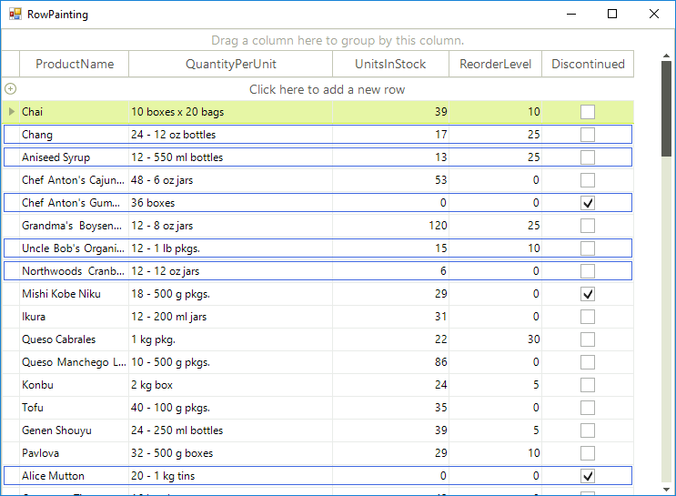

# Painting Rows

__RowPaint__ event occurs when a row needs to be painted. If you want to allow the event to fire, you should set the __EnableCustomDrawing__ to *true*. The scenario for using the __RowPaint__ event is applied when you want to apply custom painting to extend the row appearance.  

{{source=..\SamplesCS\GridView\Rows\RowPainting.cs region=enableCustomDrawing}} 
{{source=..\SamplesVB\GridView\Rows\RowPainting.vb region=enableCustomDrawing}} 

````C#
radGridView1.EnableCustomDrawing = true;

````
````VB.NET
RadGridView1.EnableCustomDrawing = True

````

{{endregion}} 

The following example demonstrates how to use the __RowPaint__ event to set up the row appearance depending on *"UnitsInStock"* cell value. If the cell value is more than *20*, no custom painting is applied and the row is drawn as it is by default. Otherwise an additional border is drawn inside the row to show that this product units in stock is getting lower (less than *20*).

>important When handling this event, you should access the row through the parameters of the event handler rather than access the row directly.
>

#### Paint border when specific criteria is met.

{{source=..\SamplesCS\GridView\Rows\RowPainting.cs region=handlingRowPaint}} 
{{source=..\SamplesVB\GridView\Rows\RowPainting.vb region=handlingRowPaint}} 

````C#
private void radGridView1_RowPaint(object sender, GridViewRowPaintEventArgs e)
{
    GridDataRowElement dataRow = e.Row as GridDataRowElement;
    if (dataRow != null)
    {
        double value = Convert.ToDouble(dataRow.RowInfo.Cells["UnitsInStock"].Value);
        if (value > 20)
        {
            return;
        }
        Pen pen = value < 0 ? Pens.Purple : Pens.RoyalBlue;
        Size rowSize = dataRow.Size;
        rowSize.Height -= 6;
        rowSize.Width -= 5;
        e.Graphics.DrawRectangle(pen, new Rectangle(new Point(2, 2), rowSize));
    }
}

````
````VB.NET
Private Sub radGridView1_RowPaint(ByVal sender As Object, ByVal e As GridViewRowPaintEventArgs) Handles RadGridView1.RowPaint
    Dim dataRow As GridDataRowElement = TryCast(e.Row, GridDataRowElement)
    If dataRow IsNot Nothing Then
        Dim value As Integer = Convert.ToInt32(dataRow.RowInfo.Cells("UnitsInStock").Value)
        If value > 20 Then
            Return
        End If
        Dim pen As Pen = If(value < 0, Pens.Purple, Pens.RoyalBlue)
        Dim rowSize As Size = dataRow.Size
        rowSize.Height -= 6
        rowSize.Width -= 5
        e.Graphics.DrawRectangle(pen, New Rectangle(New Point(2, 2), rowSize))
    End If
End Sub

````

{{endregion}} 



# See Also
* [Adding and Inserting Rows]()

* [Conditional Formatting Rows]()

* [Creating custom rows]()

* [Drag and Drop]()

* [Formatting Rows]()

* [GridViewRowInfo]()

* [Iterating Rows]()

* [New Row]()

