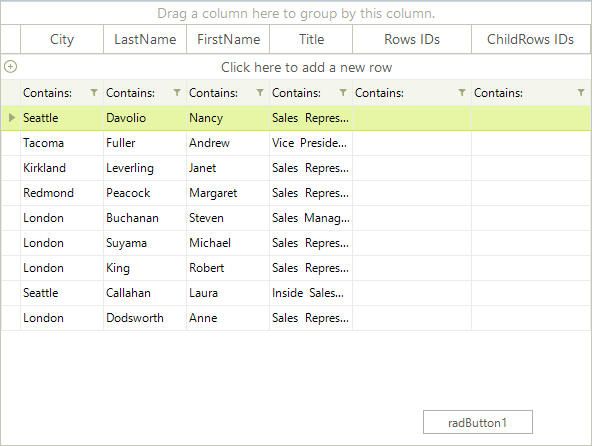
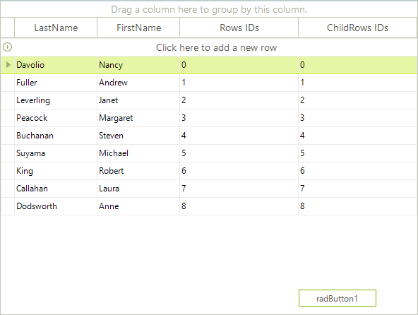
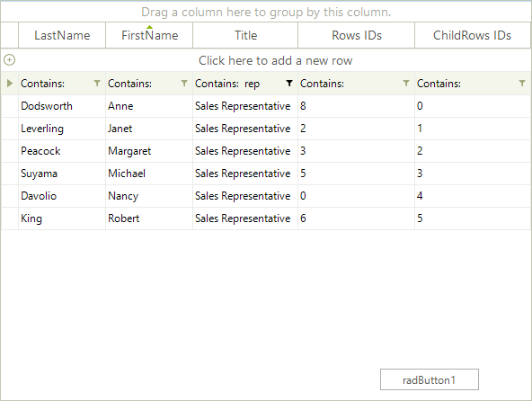
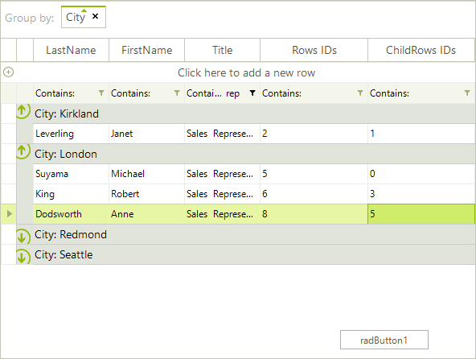

# Rows vs ChildRows

RadGridView exposes two collections that contain data rows:

* __Rows__. This collections contains all data rows that belong to RadGridView. Data operations such as grouping, sorting, filtering, etc. do not change the content of the collection or the order in which the row objects exist in the collection.

* __ChildRows__. This collection returns the data rows that are currently represented by RadGridView in the order in which they appear. The collection is modified every time a data operation (grouping, sorting, filtering) occurs. Depending on the data operation applied, this collection may contain 'system' rows, i.e. grouping rows, that are not a part of the original set of data rows contained in the __Rows__ collection. For a better understanding of the difference between __Rows__ and __ChildRows__, let's analyze the following example.

## Rows vs. ChildRows Example



Let's start with a RadGridView bound to the `Employees` data table of the well-known Northwind data base. We will add two columns - one that will represent the indices of the rows in the context of the Rows collection and one that will represent the indices of the rows in the context of the __ChildRows__ collection. Then, we will execute some data operations on the RadGridView instance to demonstrate how this reflects on the __ChildRows__ collection.

1\. First, let's add the columns:

{{source=..\SamplesCS\GridView\Rows\RowsChildRows.cs region=addingColumn}} 
{{source=..\SamplesVB\GridView\Rows\RowsChildRows.vb region=addingColumn}} 

````C#
GridViewTextBoxColumn rowsIDColumn = new GridViewTextBoxColumn();
rowsIDColumn.HeaderText = "Rows IDs";
rowsIDColumn.Name = "RowsIDs";
this.radGridView1.Columns.Add(rowsIDColumn);
GridViewTextBoxColumn childRowsIDColumn = new GridViewTextBoxColumn();
childRowsIDColumn.HeaderText = "ChildRows IDs";
childRowsIDColumn.Name = "ChildRowsIDs";
this.radGridView1.Columns.Add(childRowsIDColumn);

````
````VB.NET
Dim rowsIDColumn As New GridViewTextBoxColumn()
rowsIDColumn.HeaderText = "Rows IDs"
rowsIDColumn.Name = "RowsIDs"
Me.RadGridView1.Columns.Add(rowsIDColumn)
Dim childRowsIDColumn As New GridViewTextBoxColumn()
childRowsIDColumn.HeaderText = "ChildRows IDs"
childRowsIDColumn.Name = "ChildRowsIDs"
Me.RadGridView1.Columns.Add(childRowsIDColumn)

````

{{endregion}} 

2\. Then, let's fill these columns with integers based on the order of the rows in the __Rows__ and the __ChildRows__ collections:

{{source=..\SamplesCS\GridView\Rows\RowsChildRows.cs region=fillingColumns}} 
{{source=..\SamplesVB\GridView\Rows\RowsChildRows.vb region=fillingColumns}} 

````C#
private void radButton1_Click(object sender, EventArgs e)
{
    SetIDs();
}
private void SetIDs()
{
    for (int i = 0; i < this.radGridView1.Rows.Count; i++)
    {
        this.radGridView1.Rows[i].Cells["RowsIDs"].Value = i.ToString();
    }
    for (int i = 0; i < this.radGridView1.ChildRows.Count; i++)
    {
        this.radGridView1.ChildRows[i].Cells["ChildRowsIDs"].Value = i.ToString();
    }           
}

````
````VB.NET
Private Sub radButton1_Click(ByVal sender As Object, ByVal e As EventArgs)
    SetIDs()
End Sub
Private Sub SetIDs()
    For i As Integer = 0 To Me.RadGridView1.Rows.Count - 1
        Me.RadGridView1.Rows(i).Cells("RowsIDs").Value = i.ToString()
    Next i
    For i As Integer = 0 To Me.RadGridView1.ChildRows.Count - 1
        Me.RadGridView1.ChildRows(i).Cells("ChildRowsIDs").Value = i.ToString()
    Next i
End Sub

````

{{endregion}} 

 

As you can see in the screenshot above, in a grid with no data operations applied, the indices of the rows in the context of the __Rows__ and the indices of the rows in the context of the __ChildRows__ match.
              

3\.  Let's now filter RadGridView. For example, let's type 'rep' in the Title column. RadGridView will return only those rows which have the value 'Sales Representative' in their Title cells. When the filter data operation occurs, the FilterChanged event is fired, and in its event handler we refill our two columns with indices using the same method that we used before - SetIDs().

{{source=..\SamplesCS\GridView\Rows\RowsChildRows.cs region=filterChanged}} 
{{source=..\SamplesVB\GridView\Rows\RowsChildRows.vb region=filterChanged}} 

````C#
void radGridView1_FilterChanged(object sender, Telerik.WinControls.UI.GridViewCollectionChangedEventArgs e)
{
    SetIDs();
}

````
````VB.NET
Private Sub radGridView1_FilterChanged(ByVal sender As Object, ByVal e As Telerik.WinControls.UI.GridViewCollectionChangedEventArgs)
    SetIDs()
End Sub

````

{{endregion}} 


 

As you can see in the screenshot above, the indices of the rows do not match anymore. While the indices of the __ChildRows__ column are still consequent numbers, the indices of the Rows column are not. This is, because the __ChildRows__ collection is based on what you get from RadGridView on the screen, while the __Rows__ collection contains all the rows that RadGridView contains, but which may not be presented to the user, because of some data operation.
              

4\. Let's now sort the records that we get from Step 3 by sorting by the First Name column. The `SortChanged` event is fired and we refill the two custom columns with indices:

{{source=..\SamplesCS\GridView\Rows\RowsChildRows.cs region=sortChanged}} 
{{source=..\SamplesVB\GridView\Rows\RowsChildRows.vb region=sortChanged}} 

````C#
void radGridView1_SortChanged(object sender, Telerik.WinControls.UI.GridViewCollectionChangedEventArgs e)
{
    SetIDs();
}

````
````VB.NET
Private Sub radGridView1_SortChanged(ByVal sender As Object, ByVal e As Telerik.WinControls.UI.GridViewCollectionChangedEventArgs)
    SetIDs()
End Sub

````

{{endregion}} 



The result is expected and follows the explanation in step 3. The rows in the __ChildRows__ collection are only the rows that are displayed by RadGridView and are ordered in the order they are represented. On the other hand, the row instances and their order in the __Rows__ collection is not changed.
              

5\. Finally, let's group the filtered and sorted data by the City column. The GroupChanged event is fired and in the GroupChanged event handler we again fill the two columns with indices:

{{source=..\SamplesCS\GridView\Rows\RowsChildRows.cs region=groupByChanged}} 
{{source=..\SamplesVB\GridView\Rows\RowsChildRows.vb region=groupByChanged}} 

````C#
void radGridView1_GroupByChanged(object sender, GridViewCollectionChangedEventArgs e)
{
    SetIDs();
}

````
````VB.NET
Private Sub radGridView1_GroupByChanged(ByVal sender As Object, ByVal e As Telerik.WinControls.UI.GridViewCollectionChangedEventArgs)
    SetIDs()
End Sub

````

{{endregion}}



However, as you can see, something seems wrong, because the data in the ChildRows IDs cells does not make sense. Why is this so? This is, because now the ChildRows collection of RadGridView has four rows and they are the group header rows. Each of these groups rows has a ChildRows collection which contains the actual grouped data rows. So, if we slightly modify the body of the SetIDs method as shown below, we will get the correct and expected result. In short, we access the group header rows and change their text according to the order in which they appear in the ChildRows collections. Further, we iterate over the ChildRows collections of the group header rows and set the indices to the data rows:

{{source=..\SamplesCS\GridView\Rows\RowsChildRows.cs region=updatedSet}} 
{{source=..\SamplesVB\GridView\Rows\RowsChildRows.vb region=updatedSet}} 

````C#
private void SetIDs()
{
    for (int i = 0; i < this.radGridView1.Rows.Count; i++)
    {
        this.radGridView1.Rows[i].Cells["RowsIDs"].Value = i.ToString();
    }
    for (int i = 0; i < this.radGridView1.ChildRows.Count; i++)
    {
        this.radGridView1.ChildRows[i].Cells["ChildRowsIDs"].Value = i.ToString();
        GridViewGroupRowInfo groupRowInfo = this.radGridView1.ChildRows[i] as GridViewGroupRowInfo;
        if (groupRowInfo != null)
        {
            groupRowInfo.HeaderText = groupRowInfo.HeaderText + " " + i.ToString();
            for (int p = 0; p < this.radGridView1.ChildRows[i].ChildRows.Count; p++)
            {
                this.radGridView1.ChildRows[i].ChildRows[p].Cells["ChildRowsIDs"].Value = p.ToString();
            }
        }
    }
}

````
````VB.NET
Private Sub SetIDs()
    For i As Integer = 0 To Me.radGridView1.Rows.Count - 1
        Me.radGridView1.Rows(i).Cells("RowsIDs").Value = i.ToString()
    Next i
    For i As Integer = 0 To Me.radGridView1.ChildRows.Count - 1
        Me.radGridView1.ChildRows(i).Cells("ChildRowsIDs").Value = i.ToString()
        Dim groupRowInfo As GridViewGroupRowInfo = TryCast(Me.radGridView1.ChildRows(i), GridViewGroupRowInfo)
        If groupRowInfo IsNot Nothing Then
            groupRowInfo.HeaderText = groupRowInfo.HeaderText & " " & i.ToString()
            For p As Integer = 0 To Me.radGridView1.ChildRows(i).ChildRows.Count - 1
                Me.radGridView1.ChildRows(i).ChildRows(p).Cells("ChildRowsIDs").Value = p.ToString()
            Next p
        End If
    Next i
End Sub

````

{{endregion}} 


## Index properties
      
There are a few properties in the API of RadGridView from which you can get the index of a Row. All these properties return the index of the row in the context of the __ChildRows__ collection. If you get an index via such a property, you should not use it in combination with the __Rows__ collection, because this will return unexpected results. Here are some of the places in the API where you can find a property that returns the row index:
        

*  __GridViewRowInfo.Index__. Data rows (GridViewDataRowInfo), group rows (GridViewGroupRowInfo), hierarchy rows (GridViewHierarchyRowInfo), all they derive from GridViewRowInfo, so they expose the __Index__ property.
            

* __CellElement.RowIndex__. If you use our [ Formatting events ]() to style the cells in RadGridView, you undoubtedly work with the CellElement that comes from the event arguments of these events. The CellElement exposes the __RowIndex__ property which is a shortcut to  __CellElement.RowInfo.Index__ API.
            
# See Also
* [Adding and Inserting Rows]()

* [Conditional Formatting Rows]()

* [Creating custom rows]()

* [Drag and Drop]()

* [Formatting Rows]()

* [GridViewRowInfo]()

* [Iterating Rows]()

* [New Row]()

