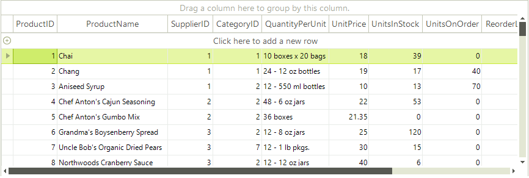

# Events

There are a vertical and a horizontal scroll bar objects for the vertical and horizontal scroll bars respectively. 



They can be accessed via the TableElement.**VScrollBar** and TableElement.**HScrollBar** properties. You can detect when one of the scroll bar's value changes by handling the **ValueChanged** event of the respective **RadScrollBarElement**.

For instance, to subscribe to **ValueChanged** event of the vertical scroll bar use the following code:

{{source=..\SamplesCS\GridView\Scrolling\Scrolling.cs region=Subscribe}} 
{{source=..\SamplesVB\GridView\Scrolling\Scrolling.vb region=Subscribe}} 

````C#
radGridView1.TableElement.VScrollBar.ValueChanged += new EventHandler(VScrollBar_ValueChanged);

````
````VB.NET
AddHandler Me.RadGridView1.TableElement.VScrollBar.ValueChanged, AddressOf VScrollBar_ValueChanged

````

{{endregion}} 


#### ScrollBar value changed event

{{source=..\SamplesCS\GridView\Scrolling\Scrolling.cs region=scrollBarValueChanged}} 
{{source=..\SamplesVB\GridView\Scrolling\Scrolling.vb region=scrollBarValueChanged}} 

````C#
void VScrollBar_ValueChanged(object sender, EventArgs e)
{
    Console.WriteLine(this.radGridView1.TableElement.VScrollBar.Value);
}

````
````VB.NET
Sub VScrollBar_ValueChanged(ByVal sender As Object, ByVal e As EventArgs)
    Console.WriteLine(Me.RadGridView1.TableElement.VScrollBar.Value)
End Sub

````

{{endregion}} 

>caution Please note that **RadGridView** **Scroll** event is NOT used.
>

# See Also
* [Scrolling Programmatically]()

