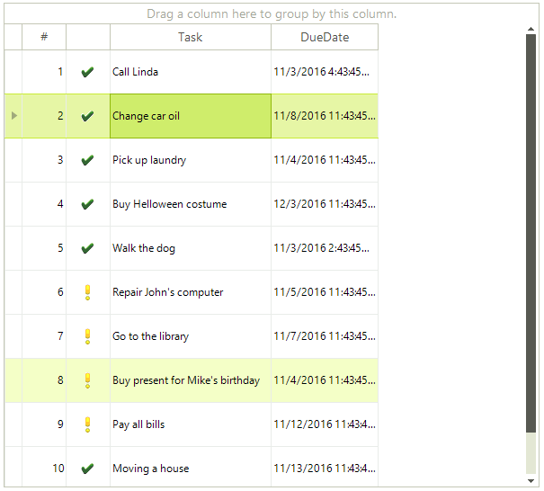
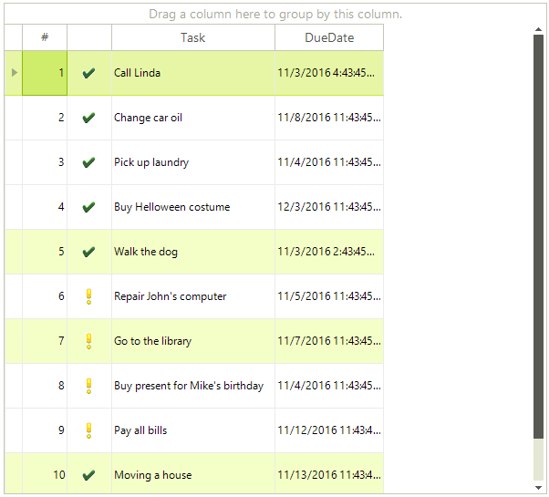

# Selecting Rows and Cells Programmatically

## Selecting a single row

You can select a single row programmatically by setting its __IsSelected__ property to *true*:

{{source=..\SamplesCS\GridView\Selection\Selection1.cs region=isRowSelected}} 
{{source=..\SamplesVB\GridView\Selection\Selection1.vb region=isRowSelected}} 

````C#
radGridView1.Rows[2].IsSelected = true;

````
````VB.NET
RadGridView1.Rows(2).IsSelected = True

````

{{endregion}} 

You can also select a single row by making it current:

{{source=..\SamplesCS\GridView\Selection\Selection1.cs region=isRowCurrent}} 
{{source=..\SamplesVB\GridView\Selection\Selection1.vb region=isRowCurrent}} 

````C#
radGridView1.Rows[2].IsCurrent = true;

````
````VB.NET
RadGridView1.Rows(2).IsCurrent = True

````

{{endregion}}

Both ways of selecting a single row will result in adding this row into the RadGridView.__SelectedRows__ collection.



## Selecting multiple rows

You can select multiple rows programmatically by setting their **IsSelected** property to *true*:

{{source=..\SamplesCS\GridView\Selection\Selection1.cs region=selectMultipleRows}} 
{{source=..\SamplesVB\GridView\Selection\Selection1.vb region=selectMultipleRows}} 

````C#
radGridView1.ClearSelection();
radGridView1.MultiSelect = true;
radGridView1.SelectionMode = Telerik.WinControls.UI.GridViewSelectionMode.FullRowSelect;
radGridView1.Rows[0].IsSelected = true;
radGridView1.Rows[4].IsSelected = true;
radGridView1.Rows[6].IsSelected = true;
radGridView1.Rows[9].IsSelected = true;

````
````VB.NET
RadGridView1.ClearSelection()
RadGridView1.MultiSelect = True
RadGridView1.SelectionMode = Telerik.WinControls.UI.GridViewSelectionMode.FullRowSelect
RadGridView1.Rows(0).IsSelected = True
RadGridView1.Rows(4).IsSelected = True
RadGridView1.Rows(6).IsSelected = True
RadGridView1.Rows(9).IsSelected = True

````

{{endregion}} 




In this scenario all four rows are added to the __SelectedRows__ collection of **RadGridView**. You can access the instances of the selected rows in the __SelectedRows__ collection by index:

{{source=..\SamplesCS\GridView\Selection\Selection1.cs region=gettingSelectedRow}} 
{{source=..\SamplesVB\GridView\Selection\Selection1.vb region=gettingSelectedRow}} 

````C#
GridViewRowInfo selectedRow = radGridView1.SelectedRows[0];

````
````VB.NET
Dim selectedRow As GridViewRowInfo = RadGridView1.SelectedRows(0)

````

{{endregion}} 

>note The rows are added to the __SelectedRows__ collection in the same order as the order in which you have set the selected rows.

## Selecting a single cell

You can select cells the same way you select rows – by setting their **IsSelected** property to *true*:

{{source=..\SamplesCS\GridView\Selection\Selection1.cs region=selectingCell}} 
{{source=..\SamplesVB\GridView\Selection\Selection1.vb region=selectingCell}} 

````C#
radGridView1.ClearSelection();
radGridView1.SelectionMode = Telerik.WinControls.UI.GridViewSelectionMode.CellSelect;
//here instead of a cell index you can specify the Name of the column as a string
//i.e. radGridView1.Rows[1].Cells[“Column 1”].IsSelected = true;
radGridView1.Rows[1].Cells[3].IsSelected = true;

````
````VB.NET
RadGridView1.ClearSelection()
RadGridView1.SelectionMode = Telerik.WinControls.UI.GridViewSelectionMode.CellSelect
'here instead of a cell index you can specify the Name of the column as a string
'i.e. radGridView1.Rows(1).Cells(“Column 1”).IsSelected = true
RadGridView1.Rows(1).Cells(3).IsSelected = True

````

{{endregion}} 

Selecting a single cell will result in adding this cell into the RadGridView.**SelectedCells** collection.


## Selecting multiple cells

Selecting multiple cells programmatically is achieved by setting the __IsSelected__ property of the desired cells to *true*.

{{source=..\SamplesCS\GridView\Selection\Selection1.cs region=selectMultipleCells}} 
{{source=..\SamplesVB\GridView\Selection\Selection1.vb region=selectMultipleCells}} 

````C#
radGridView1.MultiSelect = true;
radGridView1.SelectionMode = Telerik.WinControls.UI.GridViewSelectionMode.CellSelect;
radGridView1.Rows[0].Cells[0].IsSelected = true;
radGridView1.Rows[3].Cells[1].IsSelected = true;
radGridView1.Rows[5].Cells[2].IsSelected = true;
radGridView1.Rows[6].Cells[3].IsSelected = true;

````
````VB.NET
RadGridView1.MultiSelect = True
RadGridView1.SelectionMode = Telerik.WinControls.UI.GridViewSelectionMode.CellSelect
RadGridView1.Rows(0).Cells(0).IsSelected = True
RadGridView1.Rows(3).Cells(1).IsSelected = True
RadGridView1.Rows(5).Cells(2).IsSelected = True
RadGridView1.Rows(6).Cells(3).IsSelected = True

````

{{endregion}} 


In this scenario all four cells will be added to the __SelectedCells__ collection of **RadGridView**. You can access the instances of the selected cells in the __SelectedCells__ collection by index:

{{source=..\SamplesCS\GridView\Selection\Selection1.cs region=gettingSelectedCell}} 
{{source=..\SamplesVB\GridView\Selection\Selection1.vb region=gettingSelectedCell}} 

````C#
GridViewCellInfo selectedCell = radGridView1.SelectedCells[0];

````
````VB.NET
Dim selectedCell As GridViewCellInfo = RadGridView1.SelectedCells(0)

````

{{endregion}} 

Note that the cells are added to the collection in the same order as the order in which you have set the selected cells.

## BaseGridNavigator's Selection API 

**BaseGridNavigator** provides a suitable API for selecting rows and columns programmatically. It can be accessed by the RadGridView.**GridNavigator** property. The following table lists the available public methods:

|Method|Description|
|----|----|
|**SelectAll**|Select all rows and cells.|
|**ClearSelection**|Clears the selection.|
|**BeginSelection**|Begins grid selection.|
|**EndSelection**|Ends selection.|
|**Select(GridViewRowInfo row, GridViewColumn column)**|Selects the sepcified row as current and specified column as current.|
|**SelectFirstRow**|Selects the first row as current column in grid. The method returns *true* if the operation is successful.|
|**SelectLastRow**|Selects the last row as current row in grid. The method returns *true* if the operation is successful.|
|**SelectRow(GridViewRowInfo row)**|Selects the specified row as current row in grid. The method returns *true* if the operation is successful.|
|**SelectNextRow(int step)**| Selects the row at specified distance after the current position as current row in grid. The method returns *true* if the operation is successful.|
|**SelectPreviousRow(int step)**|Selects the row at specified distance before the current position as current row in grid. The method returns *true* if the operation is successful.|
        
# See Also
* [Basic Selection]()

* [Multiple Selection]()

