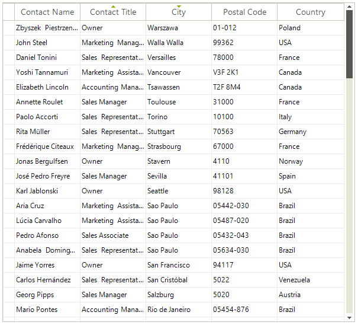

# Basic Sorting

**RadGridView** supports data sorting. Set the __EnableSorting__ or GridViewTemplate.__EnableSorting__ properties to *true* which will enable the *user sorting* feature:

#### Enabling the user sorting

{{source=..\SamplesCS\GridView\Sorting\Sorting.cs region=enableSorting}} 
{{source=..\SamplesVB\GridView\Sorting\Sorting.vb region=enableSorting}} 

````C#
this.radGridView1.MasterTemplate.EnableSorting = true;

````
````VB.NET
Me.RadGridView1.MasterTemplate.EnableSorting = True

````

{{endregion}} 

When sorting is enabled, the user can click on the column headers to control the sorting order. **RadGridView** supports three orders: __Ascending__, __Descending__, and __None__ (no sort). Since R1 2017 columns have a property called **AllowNaturalSort** that defines whether the user will cycle through *no sort* when clicking on the header cell or whether once sorted the column cannot be "unsorted".



>important By default if the rows count is less than 10 000 we use quick sort to order the items. If there are more items we use Red-Black tree. This is controlled by the __UseHybridIndex__ property.

#### Change UseHybridIndex

````C#
(radGridView.MasterTemplate.ListSource.CollectionView as GridDataView).UseHybridIndex = false;
````
````VB
TryCast(radGridView.MasterTemplate.ListSource.CollectionView, GridDataView).UseHybridIndex = False
````

**RadGridView** allows you to prevent the built-in data sorting operation but keep the sorting life cycle as it is, e.g. UI indication, **SortDescriptors** and events remain. This is controlled by the MasterTemplate.DataView.**BypassSort** property which default value is *false*. This means that **RadGridView** won't perform the sorting if you set it to *true*. This may be suitable for cases in which you bound the grid to a **DataTable** and you want to apply the sort direction to the **DataTable**, not to the grid itself. You can find below a sample code snippet:

#### Bypass default sorting

{{source=..\SamplesCS\GridView\Sorting\Sorting.cs region=BypassSorting}} 
{{source=..\SamplesVB\GridView\Sorting\Sorting.vb region=BypassSorting}} 

````C#
        
DataTable dt = new DataTable();
    
public void FillData()
{
    dt.Columns.Add("Id", typeof(int));
    dt.Columns.Add("Name", typeof(string));
    
    for (int i = 0; i < 30; i++)
    {
        dt.Rows.Add(i, "Item" + i);
    }
    this.radGridView1.DataSource = dt; 
        
    this.radGridView1.MasterTemplate.DataView.BypassSort = true;
    this.radGridView1.SortChanged += radGridView1_SortChanged;
}
    
private void radGridView1_SortChanged(object sender, Telerik.WinControls.UI.GridViewCollectionChangedEventArgs e)
{
    if (e.Action == NotifyCollectionChangedAction.Add || e.Action == NotifyCollectionChangedAction.ItemChanged)
    {
        SortDescriptor s = e.NewItems[0] as SortDescriptor;
        string sortOperator = "";
        if (s.Direction == ListSortDirection.Ascending)
        {
            sortOperator = "ASC";
        }
        else
        {
            sortOperator = "DESC";
        }
        dt.DefaultView.Sort = s.PropertyName + " " + sortOperator;
    }
    if (e.Action == NotifyCollectionChangedAction.Remove)
    {
        dt.DefaultView.Sort = "";
    }
}

````
````VB.NET
Private dt As New DataTable()
Public Sub FillData()
    dt.Columns.Add("Id", GetType(Integer))
    dt.Columns.Add("Name", GetType(String))
    For i As Integer = 0 To 29
        dt.Rows.Add(i, "Item" & i)
    Next
    Me.RadGridView1.DataSource = dt
    Me.RadGridView1.MasterTemplate.DataView.BypassSort = True
    AddHandler Me.RadGridView1.SortChanged, AddressOf radGridView1_SortChanged
End Sub
Private Sub radGridView1_SortChanged(sender As Object, e As Telerik.WinControls.UI.GridViewCollectionChangedEventArgs)
    If e.Action = NotifyCollectionChangedAction.Add OrElse e.Action = NotifyCollectionChangedAction.ItemChanged Then
        Dim s As SortDescriptor = TryCast(e.NewItems(0), SortDescriptor)
        Dim sortOperator As String = ""
        If s.Direction = ListSortDirection.Ascending Then
            sortOperator = "ASC"
        Else
            sortOperator = "DESC"
        End If
        dt.DefaultView.Sort = Convert.ToString(s.PropertyName + " ") & sortOperator
    End If
    If e.Action = NotifyCollectionChangedAction.Remove Then
        dt.DefaultView.Sort = ""
    End If
End Sub

````

{{endregion}} 


See [End-user Capabilities Sorting]() topic about more information on the sorting behavior of RadGridView from the users' perspective.
# See Also
* [Custom Sorting]()

* [Events]()

* [Setting Sorting Programmatically]()

* [Sorting Expressions]()

