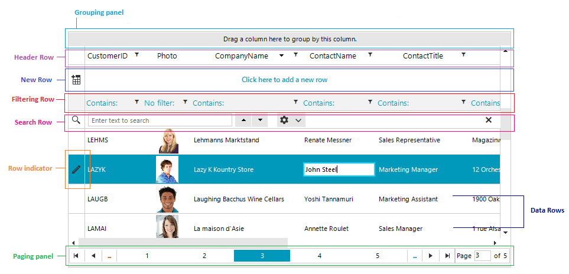
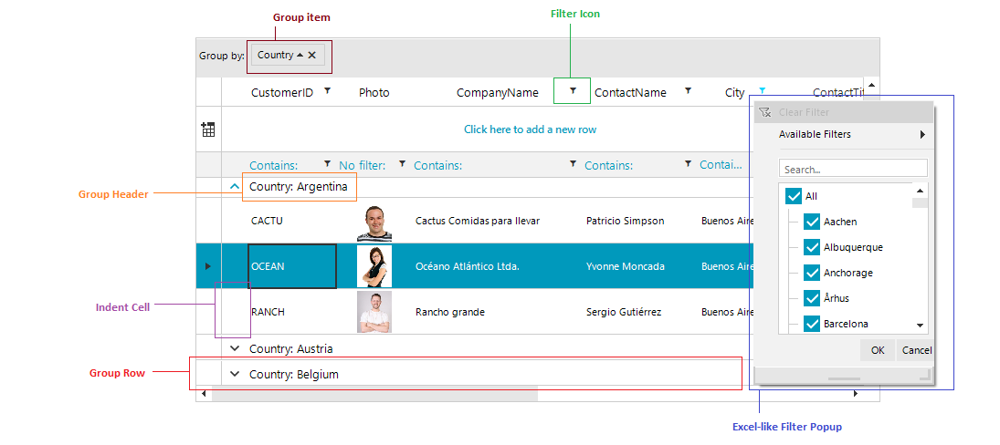

# Structure

This section defines terms and concepts used in the scope of RadGridView that you have to get familiar with prior to continue reading this help.

RadGridView is an essential user interface control used to display data in tabular format. The represented data is organized in rows and columns and can be additionally sorted, filtered, or structured in groups and sub-groups. Below you can see snapshots and explanations of the main visual elements of the control organized in logical groups.

* __Columns__: Essential building block, represented by the base class __GridViewColumn__. There is a lot of functionality coming out-of-the-box for the grid columns. They can be data bound, pinned (frozen), reordered, hidden, renamed, or auto-generated based on the underlying data source. Moreover, you can sort, filter, or group your data by one or more of the columns. You can customize their look and feel in numerous ways. [Read more]().

* __Pinned Columns__: By using the pinned (frozen) columns you will be able to stop your columns from horizontally  scrolling. Just right-click the column header and select the left or right pin option. [Read more]().

* __Rows__: Another essential building block of the control, represented by __GridViewRow__ objects. Improve the way your data is presented using Row Details inside the grid or outside it using Details Presenter. Moreover, you can control the data editing using the methods and events exposed by the GridViewRow object. [Read more]().

* __Cells__: Cells are the visual elements that do the actual representation of your data. They are represented by the __GridViewCellInfo__ object. They are also responsible for validating the data entered by the user against the underlying data type.
            
* __Header Row__: This is a special row where all column headers are displayed. It is represented by the __GridViewHeaderRowInfo__ object.

* __Row Indicators__: Each row has its own row indicator, placed on its left end. A small arrow inside the row indicator marks the current row. A pencil indicates an ongoing editing operation.
            
* __Scroll bars__: RadGridView will automatically show and hide scrollbars when needed. Choose between two types of scrolling: __Real time and Deferred__. Every hierarchical level has its own scrollbars.

* __New Row__: The new row element can be displayed on top or bottom of the data grid and allows you to easily add a new row by simply clicking on the element. Read more about this in the [New Row]() article.

* __Sort Indicator__: The sort indicator is shown in the column header when it is sorted. 

* __Edit Indicator__: This is a type of row indicator shown when the row is in edit mode.

* __Filter Icon__: You can see the filter icon placed inside the column header of each column that allows filtering or in the filtering row.
            
* __Filtering Dialog__: Clicking the filtering icon in the column headers opens a menu with the distinct values for the current column and the user can select which of those values to be displayed.

>tip Read more about the filtering feature in the [Filtering]() article.

* __Group Item__: Represents the column, by which the data is being grouped.
            
* __Group Header__: This represents the group header.		

* __Group Expander__: Using this button, you can expand/collapse the groups.	

* __Group Row__: This is the UI element that hosts and displays group records. The group row allows for expanding and collapsing the records in the group.

* __Indent Cell__: The indent cell appears when the grid data is grouped or has a hierarchical structure, to facilitate the expand/collapse functionality. The expanded cell is always placed in front of all other grid content columns and cannot be moved.
            
>tip Read more about the grouping feature in the [Grouping]() article.

## See Also

 * [Getting started]()
 * [Key features]()
 * [Element Hierarchy]()
