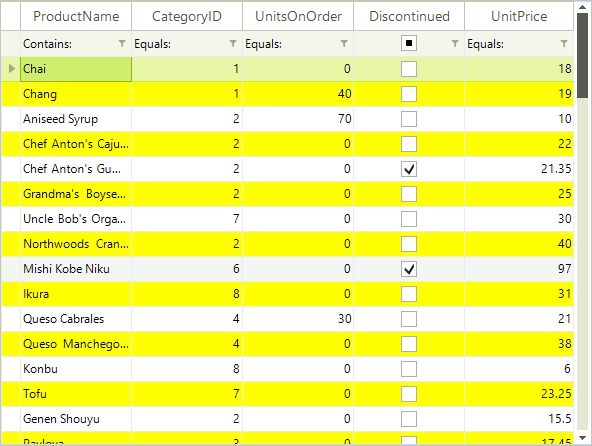

# Alternating Row Color

RadGridView supports alternating row color mode which allows you to easily distinguish one row from another.

In order to enable the feature, you should set the __EnableAlternatingRowColor__ property to *true*:

#### Enable alternating row color

<snippet id='gridview-alternatingrowcolor1-alternatingcolor-cs' />
<snippet id='gridview-alternatingrowcolor1-alternatingcolor-vb' />

In order to change the default alternating row color, set the __AlternatingRowColor__ property:

#### Changing the alternating row color

<snippet id='gridview-alternatingrowcolor1-changealternatingrow-cs' />
<snippet id='gridview-alternatingrowcolor1-changealternatingrow-vb' />

The result is shown on the screenshot below:

# See Also
* [Four ways to customize RadGridView appearance]()

* [HTML-like Text Formatting]()

* [Row Header Images]()

* [Themes]()

