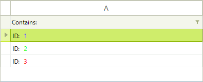

# HTML-like Text Formatting

Html-like formatting is a feature of Telerik Presentation Framework and therefore it can be also used in RadGridView. The screenshot below demonstrates the color tag applied to RadGridView cells:

Tags are only parsed if __DisableHTMLRendering__ is set to *false*. If you skip that, all tags will be shown as text. In the code snippet, HTML rendering is only enabled for the first column:

#### HTML-like text formatting

<snippet id='gridview-htmlliketextformatting-htmlliketextformatting-cs' />
<snippet id='gridview-htmlliketextformatting-htmlliketextformatting-vb' />

>note Please refer to *HTML-like Text formatting* topic in *Telerik Presentation Framework* section for the list of support tags.
>

# See Also
* [Alternating Row Color]()

* [Four ways to customize RadGridView appearance]()

* [Row Header Images]()

* [Themes]()

