# Themes

RadGridView is built on top of the Telerik Presentation Framework and enables easy styling without writing any code. It ships with a set of predefined themes that you can easily use in your application as demonstrated [here]().

The built-in themes are:

>caption Figure 1: Control Default theme

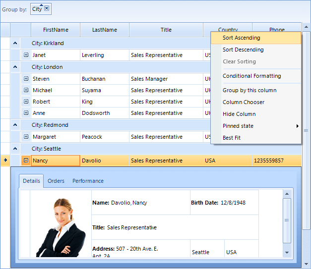 

>caption Figure 2: Office 2010 Blue theme

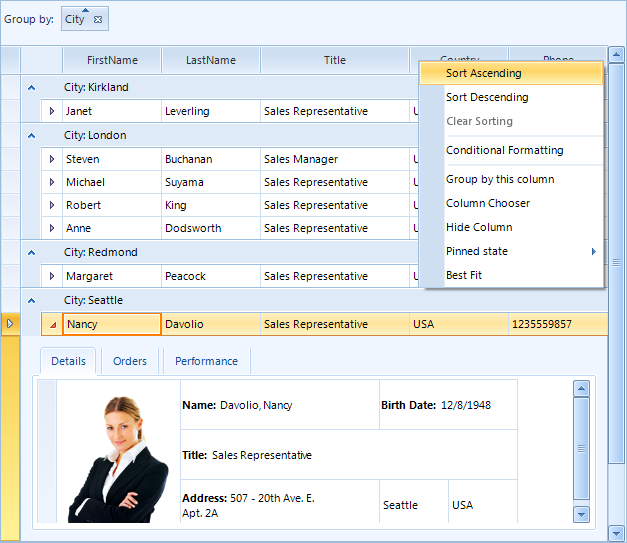 

>caption Figure 3: Office 2010 Silver theme

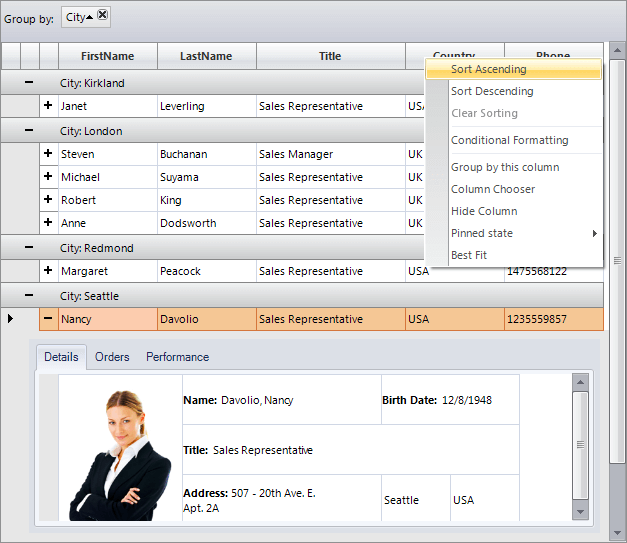 

>caption Figure 4: Office 2010 Black theme

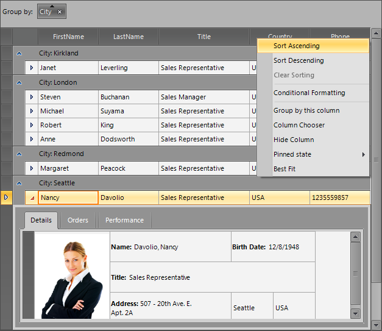 

>caption Figure 5: Office 2007 Silver theme

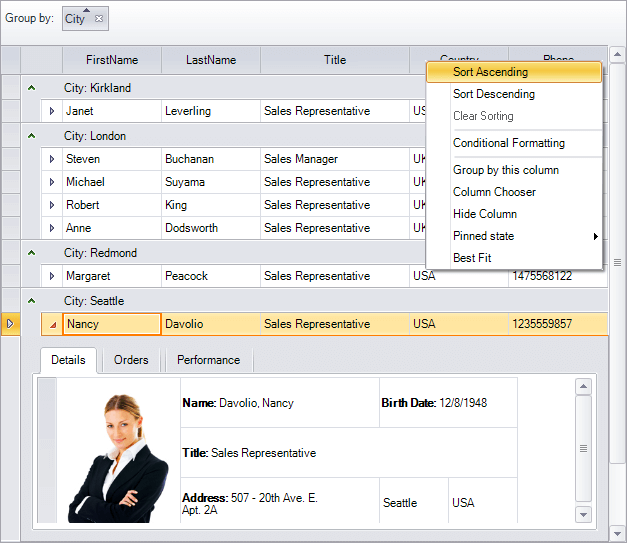 

>caption Figure 6: Office 2007 Black theme

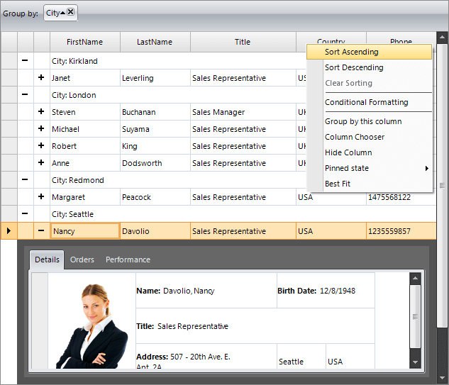 

>caption Figure 7: Telerik Metro theme

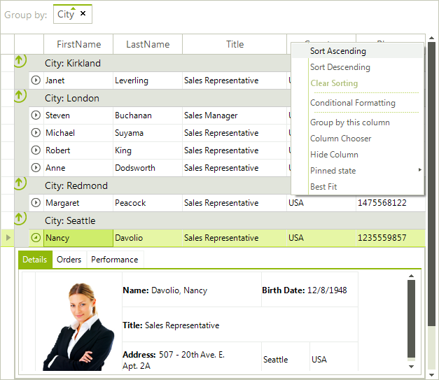 

>caption Figure 8: Telerik Metro Blue theme

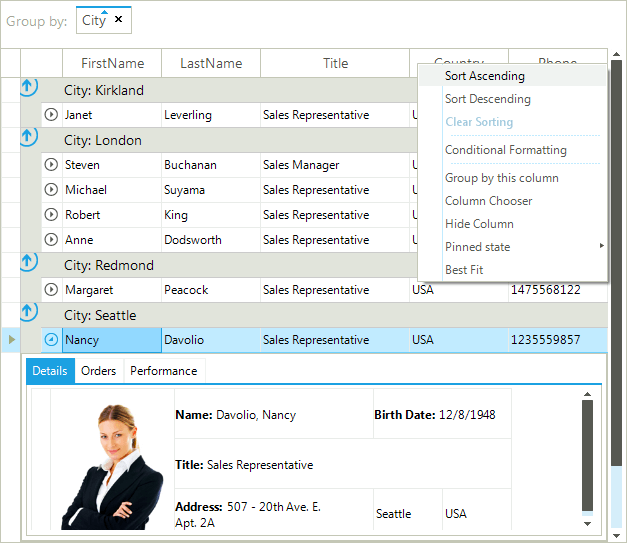 

>caption Figure 9: Windows7 theme

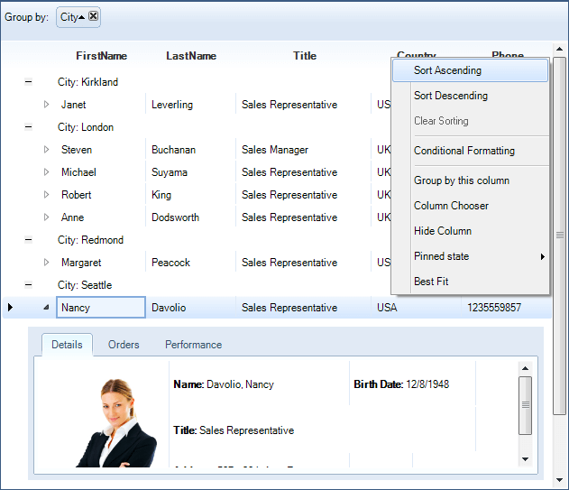 

>caption Figure 10: Desert theme

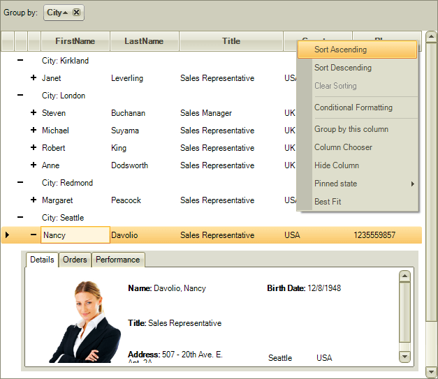 

>caption Figure 11: Breeze theme

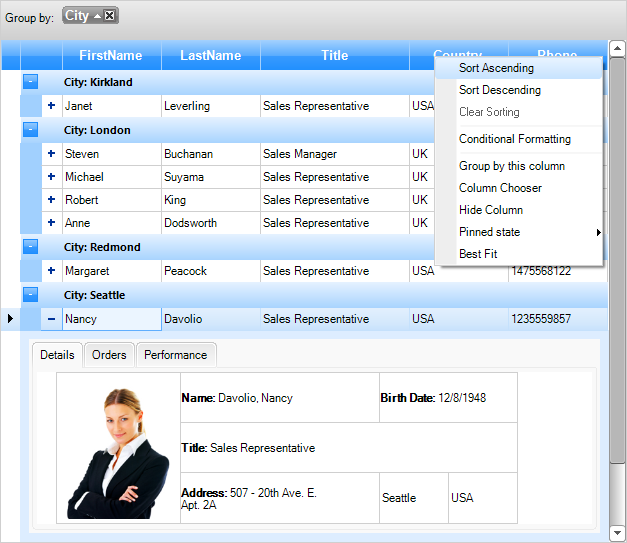 

>caption Figure 12: High Contrast Black theme

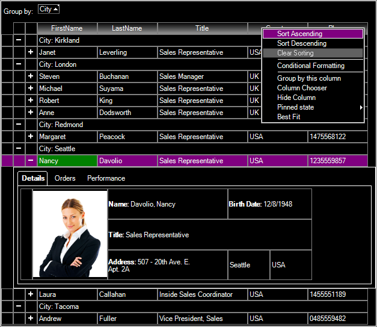 

>caption Figure 13: Visual Studio 2012 Dark theme

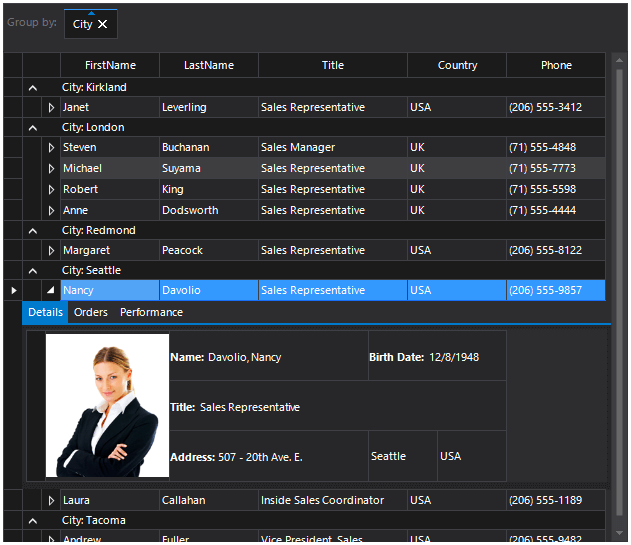 

>caption Figure 14: Visual Studio 2012 Light theme

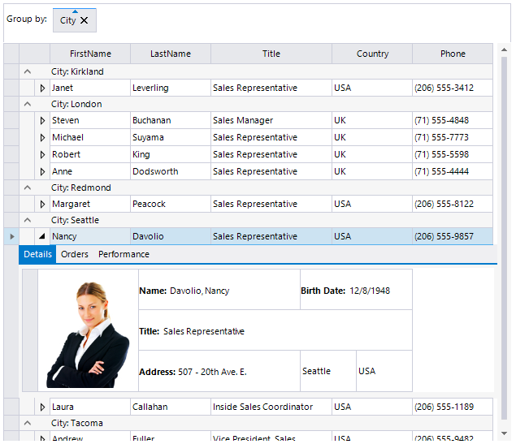 

>caption Figure 15: Office 2013 Dark theme

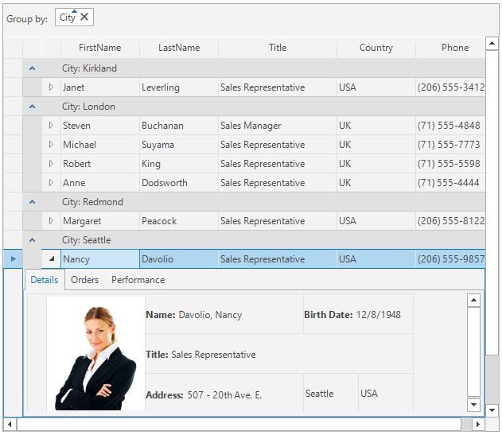 

>caption Figure 16: Office 2013 Light theme

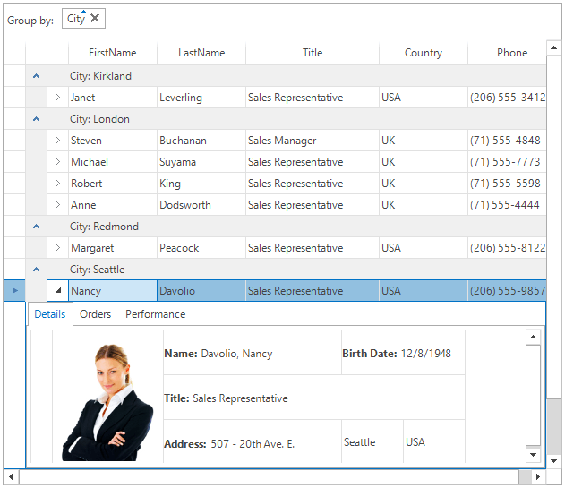 

>caption Figure 17: Windows 8 theme

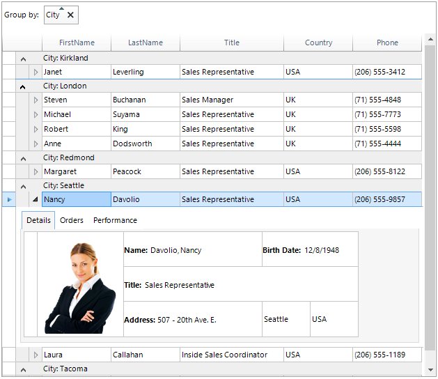 

>caption Figure 18: Aqua theme

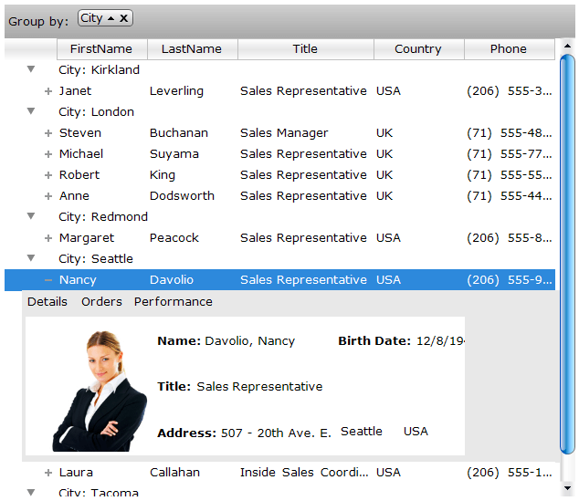 

You can preview the built-in themes using our [Theme Viewer]() application.

You can edit the existing built-in themes or you can create brand new ones using [Visual Style Builder]().

# See Also
* [Alternating Row Color]()

* [Four ways to customize RadGridView appearance]()

* [HTML-like Text Formatting]()

* [Row Header Images]()

