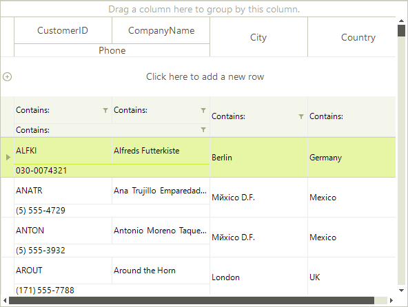

# HTML View

The name of this view may lead to some confusion. __RadGridView__ does not support HTML rendering, and there are no plans to support it. This view enables using row layout similar to the one existing in HTML tables. In fact, you can take an existing HTML table and use its HTML code in RadGridView. Sometimes this can save a lot of work. Just change the cell text to be the unique name of the desired column.



To use an HTML view we should instantiate HtmlViewDefinition and add the desired rows and cells.

#### Add rows and cells

{{source=..\SamplesCS\GridView\ViewDefinitions\HTMLView1.cs region=addRowsAndCells}} 
{{source=..\SamplesVB\GridView\ViewDefinitions\HTMLView1.vb region=addRowsAndCells}} 

````C#
HtmlViewDefinition view = new HtmlViewDefinition();
view.RowTemplate.Rows.Add(new RowDefinition());
view.RowTemplate.Rows.Add(new RowDefinition());
view.RowTemplate.Rows[0].Cells.Add(new CellDefinition("CustomerID"));
view.RowTemplate.Rows[0].Cells.Add(new CellDefinition("CompanyName"));
view.RowTemplate.Rows[0].Cells.Add(new CellDefinition("City"));
view.RowTemplate.Rows[0].Cells.Add(new CellDefinition("Country"));
view.RowTemplate.Rows[1].Cells.Add(new CellDefinition("Phone"));

````
````VB.NET
Dim view As New HtmlViewDefinition()
view.RowTemplate.Rows.Add(New RowDefinition())
view.RowTemplate.Rows.Add(New RowDefinition())
view.RowTemplate.Rows(0).Cells.Add(New CellDefinition("CustomerID"))
view.RowTemplate.Rows(0).Cells.Add(New CellDefinition("CompanyName"))
view.RowTemplate.Rows(0).Cells.Add(New CellDefinition("City"))
view.RowTemplate.Rows(0).Cells.Add(New CellDefinition("Country"))
view.RowTemplate.Rows(1).Cells.Add(New CellDefinition("Phone"))

````

{{endregion}} 

The __HtmlViewDefinition__ adds row and column spanning feature like in HTML table. This features enables spanning cells across more than one column or row. To specify a column spanning, set the __ColSpan__ property of the __CellDefinition__:

#### Set column spans

{{source=..\SamplesCS\GridView\ViewDefinitions\HTMLView1.cs region=setColSpan}} 
{{source=..\SamplesVB\GridView\ViewDefinitions\HTMLView1.vb region=setColSpan}} 

````C#
view.RowTemplate.Rows[1].Cells[0].ColSpan = 2;

````
````VB.NET
view.RowTemplate.Rows(1).Cells(0).ColSpan = 2

````

{{endregion}} 

The __RowSpan__ property sets the row spanning:

#### Set row spans

{{source=..\SamplesCS\GridView\ViewDefinitions\HTMLView1.cs region=setRowSpan}} 
{{source=..\SamplesVB\GridView\ViewDefinitions\HTMLView1.vb region=setRowSpan}} 

````C#
view.RowTemplate.Rows[0].Cells[2].RowSpan = 2;
view.RowTemplate.Rows[0].Cells[3].RowSpan = 2;

````
````VB.NET
view.RowTemplate.Rows(0).Cells(2).RowSpan = 2
view.RowTemplate.Rows(0).Cells(3).RowSpan = 2

````

{{endregion}} 

You have to set the __Height__ property of the __RowDefinition__ to change the row height:

#### Set row height.

{{source=..\SamplesCS\GridView\ViewDefinitions\HTMLView1.cs region=setRowHeight}} 
{{source=..\SamplesVB\GridView\ViewDefinitions\HTMLView1.vb region=setRowHeight}} 

````C#
view.RowTemplate.Rows[0].Height = 40;

````
````VB.NET
view.RowTemplate.Rows(0).Height = 40

````

{{endregion}} 

#### Using HTML-like syntax:

````HTML
    <table>
    <tr>
       <td>CustomerID</td>
       <td>CompanyName</td>
       <td rowspan="2">City</td>
       <td rowspan="2">Country</td>
    </tr>
    <tr>
       <td colspan="2">Phone</td>
    </tr>
    </table>
````

#### Use HTML template

{{source=..\SamplesCS\GridView\ViewDefinitions\HTMLView1.cs region=useHtmlTemplate}} 
{{source=..\SamplesVB\GridView\ViewDefinitions\HTMLView1.vb region=useHtmlTemplate}} 
````C#
view.RowTemplate.ReadXml(@"..\..\GridView\ViewDefinitions\myViewDefinition.htm");

````
````VB.NET
view.RowTemplate.ReadXml("..\..\GridView\ViewDefinitions\myViewDefinition.htm")

````

{{endregion}} 

At the end simply set the __ViewDefinitions__ property to the newly created __ViewDefinition__ instance.

{{source=..\SamplesCS\GridView\ViewDefinitions\HTMLView1.cs region=setTheViewDefinition}} 
{{source=..\SamplesVB\GridView\ViewDefinitions\HTMLView1.vb region=setTheViewDefinition}}
````C#
radGridView1.ViewDefinition = view;

````
````VB.NET
RadGridView1.ViewDefinition = view

```` 

{{endregion}} 

>caution You need to assign the view definition to the *ViewDefinition* property of RadGridView as described in the[overview section]().
>

>caution You need to either create the columns manually or supply a data source which will generate them.
>

# See Also
* [Column Groups View]()

* [Overview]()

* [Table View]()

