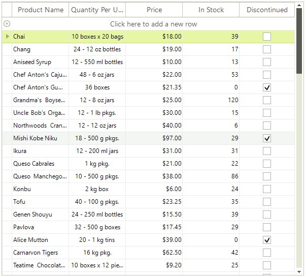

# Table View

This is the default view definition. The data is presented like a table and you can reorder, hide and pin columns. This is a typical table view:

You need do not need to set this view manually and the view does not contain any properties to configure.
		
# See Also
* [Column Groups View]()

* [HTML View]()

* [Overview]()

