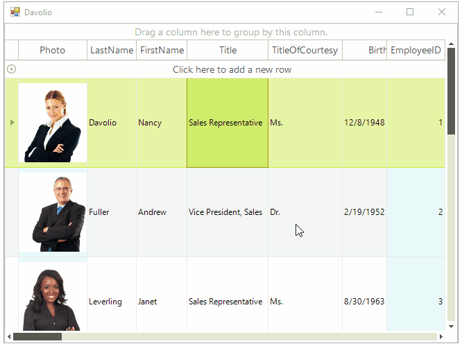

# Accessing and setting the CurrentCell

In order to set the current cell of __RadGridView__, set the __CurrentRow__ and __CurrentColumn__ properties to respective row and column which cross at the desired cell:

<snippet id='gridview-setttingcurrentcell-settingthecurrentcell-cs' />
<snippet id='gridview-setttingcurrentcell-settingthecurrentcell-vb' />

>caption Figure 1: Changing the current row changes the forms text. 

## Accessing the current cell

To get an instance of the current cell simply create a variable of type `GridDataCellElement` and assign to it the current cell:

<snippet id='gridview-setttingcurrentcell-readingthecurrentcell-cs' />
<snippet id='gridview-setttingcurrentcell-readingthecurrentcell-vb' />

>note The **CurrentCell** property can be *null* when you don't have **CurrentRow** or **CurrentColumn.**

# See Also
* [Accessing Cells]()

* [Conditional Formatting Cells]()

* [Creating Custom Cells]()

* [Formatting Cells]()

* [GridViewCellInfo]()

* [Iterating Cells]()

* [Painting and Drawing in Cells]()

* [ToolTips]()

