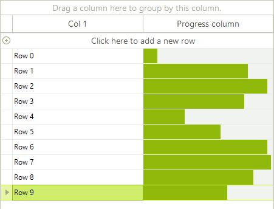
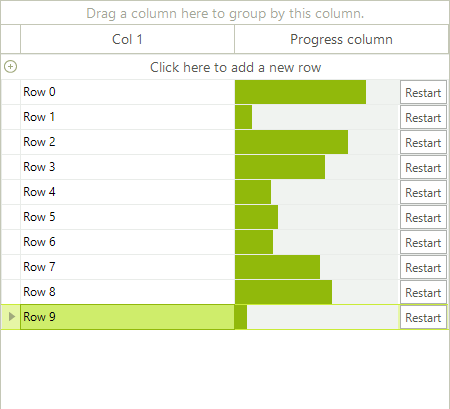
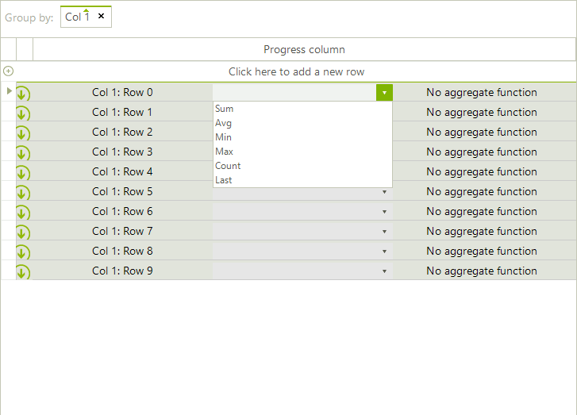

# Creating custom cells

## Custom data cell example

__RadGridView__ provides a variety of visual cells (all inheriting from __GridCellElement__) with different functionality and purpose – header cells, indent cells, command cells, summary cells, group content cells, data cells, etc. All these cover the standard cases of the control usage. In case you need to implement more specific and custom scenario, you can create a custom cell. __RadGridView__ provides powerful and flexible mechanism for creating cell types with custom content elements, functionality and properties.

You can use the following approach to create a custom data cell with a progress bar in it:

1\. Create a class for the cell which derives from __GridDataCellElement__:

<snippet id='gridview-customcells-customcelldefinition-cs' />
<snippet id='gridview-customcells-customcelldefinition-vb' />
<snippet id='gridview-customcells-createdefaultconstructor-cs' />
<snippet id='gridview-customcells-createdefaultconstructor-vb' />

2\. Create the __RadProgressBarElement__ and add it as a child of the custom cell.You can achieve this by overriding the __CreateChildElements__ method:

<snippet id='gridview-customcells-createchildelements-cs' />
<snippet id='gridview-customcells-createchildelements-vb' />

3\. Override the __SetContentCore__ method to update the progress bar according to the cell value:

<snippet id='gridview-customcells-setcontentcore-cs' />
<snippet id='gridview-customcells-setcontentcore-vb' />

4\. The custom cell will have no styles, because there are no defined styles for its type in the themes. You can apply the __GridDataCellElement’s__ styles to it by defining its __ThemeEffectiveType__:

<snippet id='gridview-customcells-themeeffectivetype-cs' />
<snippet id='gridview-customcells-themeeffectivetype-vb' />

5\. Thanks to the UI virtualization mechanism only the currently visible cells are created and they are further reused when needed. A cell element is reused in other rows or columns if it is compatible for them. You can create a custom column and define that the custom cell __IsCompatible__ for that column only. This will prevent the cell from being unintentionally reused by other columns.

<snippet id='gridview-customcells-compatibility-cs' />
<snippet id='gridview-customcells-compatibility-vb' />
<snippet id='gridview-customcells-compatibility1-cs' />
<snippet id='gridview-customcells-compatibility1-vb' />

6\. Lastly, we need to add the custom column to our grid. The following code snippet demonstrates the usage of the custom column:

<snippet id='gridview-customcells-addcolumn-cs' />
<snippet id='gridview-customcells-addcolumn-vb' />

>caption Figure 1: The custom column is now added to the grid.

## Extending the custom data cell example

You can extend the custom cell further by adding a button in it and subscribing to its __Click__ event. The button will be used to restart the progress bar by setting the cell value to 0. You can achieve this by using the following approach:

1\. Initialize and add the elements to the cell:

<snippet id='gridview-customcells-createchildelementsexample2-cs' />
<snippet id='gridview-customcells-createchildelementsexample2-vb' />

2\. Override the __ArrangeOverride__ method to arrange the children elements of the cell:

<snippet id='gridview-customcells-arrangeoverride-cs' />
<snippet id='gridview-customcells-arrangeoverride-vb' />

>caption Figure 2: The new custom cell is shown in RadgridView.

## Custom group cell example

When the __EnableGrouping__ property is set to *true* the __GroupPanelElement__ is displayed at the top of the grid. Thus, when the user drags a column and drops it onto the panel __GridGroupContentCellElements__ are created for the group rows. The following example demonstrates a sample approach how to customize the __GridGroupContentCellElement__ in order to add a drop-down with aggregate functions next to the group header and calculate the function considering the user selection

>caption Figure 3: The custom group cell contains a drop down list.

1\. Create a class that inherits the __GridGroupContentCellElement__. In its __CreateChildElements__ method we will use a __RadDropDownListElement__ which contains the aggregate functions and a __LightVisualElement__ to display the calculated result. In the __SetContent__ method we should display the cell information considering for which row it is currently being used:

<snippet id='gridview-customcells-customgroupcell-cs' />
<snippet id='gridview-customcells-customgroupcell-vb' />

2\. Subscribe to the __CreateCell__ event where we should replace the default __GridGroupContentCellElement__ with the custom one:

<snippet id='gridview-customcells-replacecustomgroupcell-cs' />
<snippet id='gridview-customcells-replacecustomgroupcell-vb' />

# See Also

* [How to Convert a GridViewCheckBoxColumn to a Custom ToggleSwitch Column]()

* [How to Create Custom Cells with Input Elements]()

* [Accessing and Setting the CurrentCell]()

* [Accessing Cells]()

* [Conditional Formatting Cells]()

* [Formatting Cells]()

* [GridViewCellInfo]()

* [Iterating Cells]()

* [Painting and Drawing in Cells]()

* [ToolTips]()

* [Create Custom Header Cells in RadGridView]()

* [Barcode Column in RadGridView]()

* [How to Save/Load Layout with Custom Columns in RadGridView]()

* [How to Display and Edit HTML Text in GridView Cells]()

* [How to Indicate RadTextBoxEditor in Grid Filter Cells]()

* [How to Embed RadRichTextEditor in GridView Cells]()

* [Build Custom GridView Cells with Stacked Elements]()
