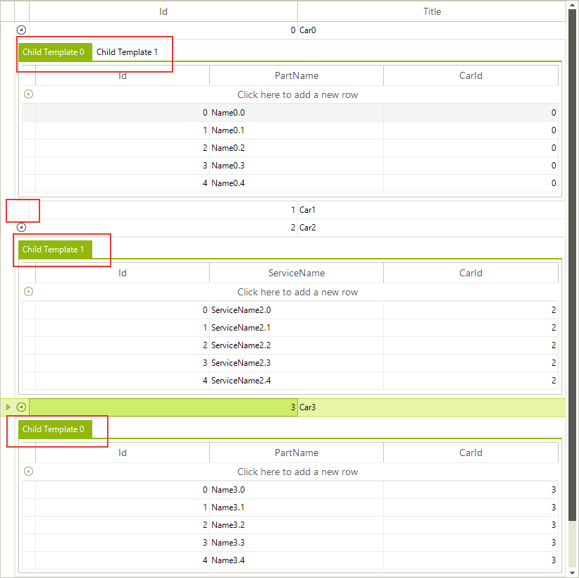

# Hiding child tabs when no data is available

When __RadGridView__ displays hierarchical data, you expand/collapse child levels in the hierarchy with the help of __GridGroupExpanderCellElement__ containing an expand/collapse image. If you have more than one template at a specific child level, these templates are displayed by using the __GridDetailViewCellElement__. Consider the __RadGridView__ has two child templates under the master template. If you expand the parent row, two tabs will be displayed for the respective child level. However, some of the child tabs may not contain any data. This example demonstrates a sample approach how to hide the child tabs if no data is available. If none of the child tabs for a specific parent row contains any data, the expander image will be hidden.

>note In order for a GridDetailViewCellElement to display a page view instead of a single table element, either the template of the row holding it has to have more than one child template, or its __ShowChildViewCaptions__ should be *true* . Once there is a page view, the tabs in it will be visible at all times, except when some of the templates has no rows and __AllowAddNewRow__ for it is *false* – if it does not have any rows and the user cannot add row, it is considered that there is no need from it.

>caption Figure 1: Using formatting event to hide empty tabs.

#### Accessing the child tabs in the ViewCellFormatting event.

<snippet id='gridview-hidechildtabs-hidetabs-cs' />
<snippet id='gridview-hidechildtabs-hidetabs-vb' />

# See Also
* [Formatting GridViewCommandColumn]()

* [Formating Group Rows]()

* [Style Property]()

