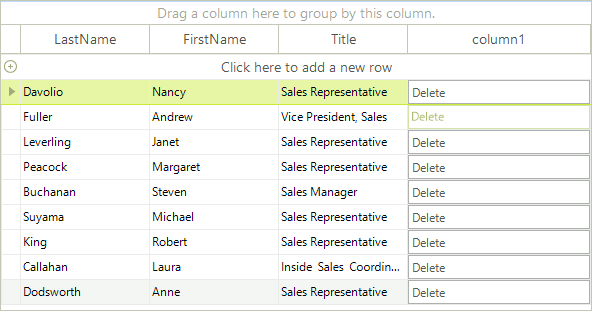

# Change the appearance of the buttons in GridViewCommandColumn  

Sometimes, you may need to change the appearance of the buttons that appear in the cells of the GridViewCommandColumn. These buttons are children of the RadGridView cells, so in order to access them, you should take them from the Children collection of the visual cells. We will demonstrate how this should be done by analyzing the following case.

Let's say that you have a number of employees. Only one employee is Vice President of the company, while the others are managers and sales representatives. In RadGridView you have a GridViewCommandColumn, the buttons of which allow the end-users to edit the details of all records, except the one that belongs to the Vice President. So, depending on the value of the Title cell, you should set the __Enabled__ property of the respective RadButtonElement to *true* or *false*. Here is how we can achieve that:

<snippet id='gridview-formattingcellsbuttons-buttoncell-cs' />
<snippet id='gridview-formattingcellsbuttons-buttoncell-vb' />

>caption Figure 1: Styling the command cell button. 

# See Also

* [Hiding Child Tabs when no Data is Available]()

* [Formating Group Rows]()

* [Style Property]()

