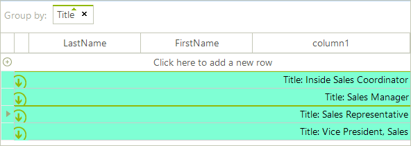

# Change TextAlignment and BackColor of group rows

To modify the text alignment and the back color in the group rows use the following code snippet:

#### Formatting group rows

{{source=..\SamplesCS\GridView\Cells\FormattingCells.cs region=viewCellFormatting2}} 
{{source=..\SamplesVB\GridView\Cells\FormattingCells.vb region=viewCellFormatting2}} 

````C#
void radGridView1_ViewCellFormatting2(object sender, CellFormattingEventArgs e)
{
    if (e.CellElement.RowInfo is GridViewGroupRowInfo)
    {
        e.CellElement.DrawFill = true;
        e.CellElement.BackColor = Color.Aquamarine;
        e.CellElement.TextAlignment = ContentAlignment.MiddleRight;
        e.CellElement.GradientStyle = Telerik.WinControls.GradientStyles.Solid;
    }
    else
    {
        e.CellElement.ResetValue(LightVisualElement.DrawFillProperty, ValueResetFlags.Local);
        e.CellElement.ResetValue(LightVisualElement.BackColorProperty, ValueResetFlags.Local);
        e.CellElement.ResetValue(LightVisualElement.TextAlignmentProperty, ValueResetFlags.Local);
        e.CellElement.ResetValue(LightVisualElement.GradientStyleProperty, ValueResetFlags.Local);
    }
}

````
````VB.NET
Private Sub RadGridView1_ViewCellFormatting2(ByVal sender As Object, ByVal e As Telerik.WinControls.UI.CellFormattingEventArgs) Handles RadGridView1.ViewCellFormatting
    If TypeOf e.CellElement.RowInfo Is GridViewGroupRowInfo Then
        e.CellElement.DrawFill = True
        e.CellElement.BackColor = Color.Aquamarine
        e.CellElement.TextAlignment = ContentAlignment.MiddleRight
        e.CellElement.GradientStyle = Telerik.WinControls.GradientStyles.Solid
    Else
        e.CellElement.ResetValue(LightVisualElement.DrawFillProperty, ValueResetFlags.Local)
        e.CellElement.ResetValue(LightVisualElement.BackColorProperty, ValueResetFlags.Local)
        e.CellElement.ResetValue(LightVisualElement.TextAlignmentProperty, ValueResetFlags.Local)
        e.CellElement.ResetValue(LightVisualElement.GradientStyleProperty, ValueResetFlags.Local)
    End If
End Sub

````

{{endregion}}

>caption Figure 1: Formatting group rows.


# See Also
* [Hiding Child Tabs when no Data is Available]()

* [Formatting GridViewCommandColumn]()

* [Style Property]()

