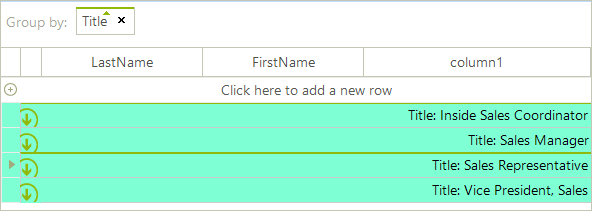

# Change TextAlignment and BackColor of group rows

To modify the text alignment and the back color in the group rows use the following code snippet:

#### Formatting group rows

<snippet id='gridview-formattingcells-viewcellformatting2-cs' />
<snippet id='gridview-formattingcells-viewcellformatting2-vb' />

>caption Figure 1: Formatting group rows.

# See Also
* [Hiding Child Tabs when no Data is Available]()

* [Formatting GridViewCommandColumn]()

* [Style Property]()

