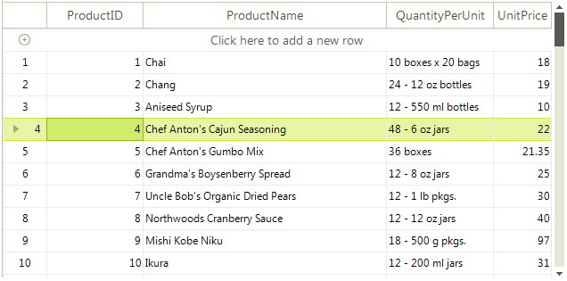

# Row Numbers

By default, **RadGridView** displays a current row indicator in the row header represented by an arrow image. A common requirement is to display the row number in the row header as well. This can be easily achieved by handling the **ViewCellFormatting** event. You can find below a sample code snippet.

>caption Figure 1: Row numbers



#### Handling the ViewCellFormatting event

{{source=..\SamplesCS\GridView\Cells\GridViewRowNumbers.cs region=RowNumbers}} 
{{source=..\SamplesVB\GridView\Cells\GridViewRowNumbers.vb region=RowNumbers}} 

````C#
    
private void radGridView1_ViewCellFormatting(object sender, CellFormattingEventArgs e)
{
    if (e.CellElement is GridRowHeaderCellElement && e.Row is GridViewDataRowInfo)
    {
        e.CellElement.Text = (e.CellElement.RowIndex + 1).ToString();
        e.CellElement.TextImageRelation = TextImageRelation.ImageBeforeText;
    }
    else
    { 
        e.CellElement.ResetValue(LightVisualElement.TextImageRelationProperty, ValueResetFlags.Local);
    }
}

````
````VB.NET
Private Sub radGridView1_ViewCellFormatting(sender As Object, e As CellFormattingEventArgs)
    If TypeOf e.CellElement Is GridRowHeaderCellElement AndAlso TypeOf e.Row Is GridViewDataRowInfo Then
        e.CellElement.Text = (e.CellElement.RowIndex + 1).ToString()
        e.CellElement.TextImageRelation = TextImageRelation.ImageBeforeText
    Else
        e.CellElement.ResetValue(LightVisualElement.TextImageRelationProperty, ValueResetFlags.Local)
    End If
End Sub

````

{{endregion}} 

>note The **RowIndex** property internally uses the **ChildRows** collection. This collection returns the data rows that are currently represented by RadGridView in the order in which they appear. The collection is modified every time a data operation (grouping, sorting, filtering) occurs. Similar to filtering, sorting and grouping, the ChildRows collection is affected by the paging as well and it contains only the records on the current page. A common scenario is to access the real row index when the paging is enabled in the order the items appear in the grid.

The RadGridView.MasterTemplate.DataView.**Indexer** offers the Items collection which contains all the rows in the order in which they appear in the grid. The collection is affected every time a data operation like grouping, sorting, filtering occurs. You can use it to extract the correct index when moving through the pages:

````C#
            
private void radGridView1_ViewCellFormatting(object sender, Telerik.WinControls.UI.CellFormattingEventArgs e)
        {
            if (e.CellElement is GridRowHeaderCellElement && e.Row is GridViewDataRowInfo)
            {
                GridDataView dataView = this.radGridView1.MasterTemplate.DataView as GridDataView;
                e.CellElement.Text = (dataView.Indexer.Items.IndexOf(e.Row) + 1).ToString();
                e.CellElement.TextImageRelation = TextImageRelation.ImageBeforeText;
            }
            else
            {
                e.CellElement.ResetValue(LightVisualElement.TextImageRelationProperty, ValueResetFlags.Local);
            }
        }

````
````VB.NET

Private Sub radGridView1_ViewCellFormatting(ByVal sender As Object, ByVal e As Telerik.WinControls.UI.CellFormattingEventArgs)
    If TypeOf e.CellElement Is GridRowHeaderCellElement AndAlso TypeOf e.Row Is GridViewDataRowInfo Then
        Dim dataView As GridDataView = TryCast(Me.radGridView1.MasterTemplate.DataView, GridDataView)
        e.CellElement.Text = (dataView.Indexer.Items.IndexOf(e.Row) + 1).ToString()
        e.CellElement.TextImageRelation = TextImageRelation.ImageBeforeText
    Else
        e.CellElement.ResetValue(LightVisualElement.TextImageRelationProperty, ValueResetFlags.Local)
    End If
End Sub

````

It is necessary to increase the header row's width in order to have enough space to display the row number and the current row indicator. This can be accomplished by setting the TableElement.**RowHeaderColumnWidth** property.

#### Adjust the RowHeaderColumnWidth

{{source=..\SamplesCS\GridView\Cells\GridViewRowNumbers.cs region=RowHeaderWidth}} 
{{source=..\SamplesVB\GridView\Cells\GridViewRowNumbers.vb region=RowHeaderWidth}} 

````C#
            
this.radGridView1.TableElement.RowHeaderColumnWidth = 50;

````
````VB.NET
Me.RadGridView1.TableElement.RowHeaderColumnWidth = 50

````

{{endregion}} 


# See Also
* [Formatting GridViewCommandColumn]()

* [Formating Group Rows]()

* [Style Property]()

