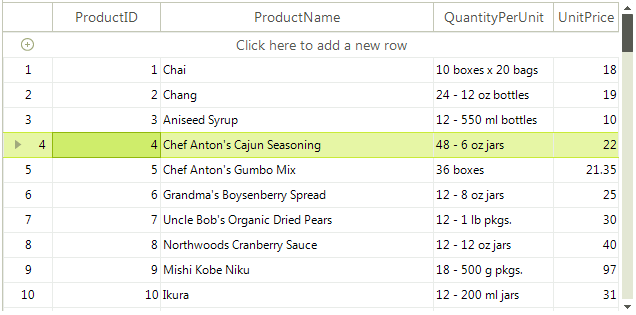

# Display Row Numbers in RadGridView

By default, `RadGridView` shows the current row indicator in the row header as an arrow. If you also want to display the row number, handle the `ViewCellFormatting` event and set the row header text for each data row.

This article shows the basic formatting approach, explains how paging affects row numbering, and shows how to make room for both the row number and the current row indicator.

**RadGridView row header that shows row numbers next to the current row indicator.**


## Show Row Numbers in the Row Header

Handle `ViewCellFormatting` when you need to update the row header text as each row is rendered. In the handler, check whether the formatted cell is a `GridRowHeaderCellElement` for a `GridViewDataRowInfo` row, then assign the row number.

The example also sets `TextImageRelation` to `ImageBeforeText` so the arrow indicator remains visible next to the number.

### Handle the ViewCellFormatting Event

<snippet id='gridview-gridviewrownumbers-rownumbers-cs' />
<snippet id='gridview-gridviewrownumbers-rownumbers-vb' />

## Keep Row Numbers Correct When Paging Is Enabled

`RowIndex` uses the `ChildRows` collection internally. `ChildRows` contains only the rows that `RadGridView` is currently displaying, in the current grouped, sorted, or filtered order. When paging is enabled, that collection includes only the rows on the current page.

>note
>
> If you use `RowIndex` while paging is enabled, the row numbers restart on each page because `ChildRows` contains only the visible records for that page.

If you need the row number in the full visible order of the grid, use `RadGridView.MasterTemplate.DataView.Indexer.Items`. This collection reflects the current grouped, sorted, and filtered order across the full data view, so it is a better source for row numbering when users move through pages.

### Use DataView.Indexer for Paged Data

```csharp
private void radGridView1_ViewCellFormatting(object sender, Telerik.WinControls.UI.CellFormattingEventArgs e)
{
    if (e.CellElement is GridRowHeaderCellElement && e.Row is GridViewDataRowInfo)
    {
        GridDataView dataView = this.radGridView1.MasterTemplate.DataView as GridDataView;
        e.CellElement.Text = (dataView.Indexer.Items.IndexOf(e.Row) + 1).ToString();
        e.CellElement.TextImageRelation = TextImageRelation.ImageBeforeText;
    }
    else
    {
        e.CellElement.ResetValue(LightVisualElement.TextImageRelationProperty, ValueResetFlags.Local);
    }
}
```

```vb
Private Sub radGridView1_ViewCellFormatting(ByVal sender As Object, ByVal e As Telerik.WinControls.UI.CellFormattingEventArgs)
    If TypeOf e.CellElement Is GridRowHeaderCellElement AndAlso TypeOf e.Row Is GridViewDataRowInfo Then
        Dim dataView As GridDataView = TryCast(Me.radGridView1.MasterTemplate.DataView, GridDataView)
        e.CellElement.Text = (dataView.Indexer.Items.IndexOf(e.Row) + 1).ToString()
        e.CellElement.TextImageRelation = TextImageRelation.ImageBeforeText
    Else
        e.CellElement.ResetValue(LightVisualElement.TextImageRelationProperty, ValueResetFlags.Local)
    End If
End Sub
```

## Increase the Row Header Width

Increase `TableElement.RowHeaderColumnWidth` so the row header has enough space for both the row number and the current row indicator. Without this adjustment, the number or the arrow can be clipped.

### Adjust the RowHeaderColumnWidth

<snippet id='gridview-gridviewrownumbers-rowheaderwidth-cs' />
<snippet id='gridview-gridviewrownumbers-rowheaderwidth-vb' />

## See Also

* [Format a GridViewCommandColumn]()
* [Format group rows]()
* [Use the Style property]()

