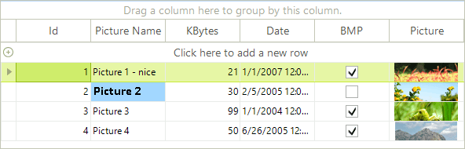

# Format cell with Style property

The GridViewCellInfo.__Style__ property gives direct access to the cell’s visual properties. It makes it possible to set styles to cells in runtime without using events like __CellFormatting__ or the __ConditionalFormattingObject__.

>note This approach lets you customize visual properties which are defined by the theme. All changes set this way will have a greater priority than the theme.
>

The first thing to do for using the cell’s __Style__ is to define what custom visual properties will use this cell. You can define that the cell will:  

* __CustomizeFill__

* __CustomizeBorder__

Using the __Style__ property allows you to define cell’s style properties:

* __Fill__

* __Border__

* __Font__

* __ForeColor__

The example below shows how to customize the __Font__ and __BackColor__ of a cell.

<snippet id='gridview-formattingcells-cellstylemethod-cs' />
<snippet id='gridview-formattingcells-cellstylemethod-vb' />

Here is how to call this method of a certain cell:

<snippet id='gridview-formattingcells-cellstylemethodcall-cs' />
<snippet id='gridview-formattingcells-cellstylemethodcall-vb' />

>caption Figure 1: Format using the Style property.

>note Before assigning a certain value to the **Style** of the data cell, you can store the initial values of the properties. Thus, you can reset the style to the initial values if the style is not needed anymore.

# See Also
* [Hiding Child Tabs when no Data is Available]()

* [Formatting GridViewCommandColumn]()

* [Formating Group Rows]()

