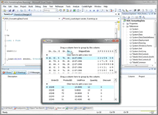
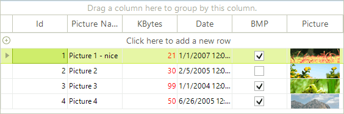
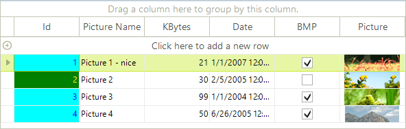
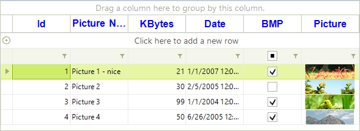
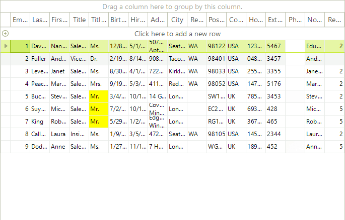

# Formatting Cells

Due to the UI virtualization in **RadGridView**, cell elements are created only for currently visible cells and are being reused during operations like scrolling, filtering, grouping and so on. In order to prevent applying the formatting to other columns' cell elements (because of the cell reuse), all customization should be reset for the rest of the cell elements. Please refer to the Fundamentals [topic]() for more information.

| RELATED VIDEOS |  |
| ------ | ------ |
|[Formatting Data In RadGridView for WinForms](http://tv.telerik.com/watch/radtips/radgrid/formatting-data-in-radgridview) In this RadTip, John Kellar demonstrates how you can apply custom formatting to data within a RadGridView for Windows Forms. (Runtime: 09:14)||

## Formatting data cells.

The __CellFormatting__ event is used to access and change the styles of the *data* cells including the *new row cells*. For example, the code sample below changes the **ForeColor** in a particular column:

#### Changing the data cells font color

<snippet id='gridview-formattingcells-cellformattingexample1-cs' />
<snippet id='gridview-formattingcells-cellformattingexample1-vb' />

 

>caption Figure 1: Changing the cells fore color. 

## Cells background formatting

This is an advanced example of using **CellFormatting** event to highlight certain cells in aqua color based on the values of cells in the same row but *different* column. In the example, the values in the first column are  highlighted if the value in the check box column returns *true*:

>caption Figure 2: Formatting cell upon a condition. 

#### Formatting cells 

<snippet id='gridview-formattingcells-cellformattingexample2-cs' />
<snippet id='gridview-formattingcells-cellformattingexample2-vb' />

 

## Formatting non-data cells

The __ViewCellFormatting__ event is fired for all cells. So if you want to format the grouping row or the header cells, you should use this event.

##  Change group and header cells font and removing the default filter operator text.

For example, to change the font of the header cells and the group cells use the following code:

####  Formatting non-data rows

<snippet id='gridview-formattingcells-viewcellformatting1-cs' />
<snippet id='gridview-formattingcells-viewcellformatting1-vb' />

 

>caption Figure 3: Formatting non-data rows.

## Formatting cells on demand   

Sometimes you may need to format the cells on a specific user action, for example, on a button click. Let's take the following scenario: you have a search box (**RadTextBox**) above **RadGridView** and a **RadButton**. When you click the button, **RadGridView** should highlight the cells that match the text typed in the **RadTextBox**. Here is how you can implement this:

* First, you should handle the **CellFormatting** event and set the back color of the cells whose text matches the text in the **RadTextBox**.

<snippet id='gridview-formattingcellsondemand-cellformatting-cs' />
<snippet id='gridview-formattingcellsondemand-cellformatting-vb' />

* The user types some text, but then you should somehow notify **RadGridView** that it needs to refresh itself. This is done by calling the __Update__ method of the **TableElement**, passing the *StateChanged* argument as a parameter.

<snippet id='gridview-formattingcellsondemand-buttonclick-cs' />
<snippet id='gridview-formattingcellsondemand-buttonclick-vb' />

As a result of the update call, the **CellFormatting** event (and the other formatting events as well) will be triggered and you will get the following results:

>caption Figure 4: Manually trigger the grid update. 

# See Also

* [Formating Group Rows]()
* [Formating Child Tabs]()
* [Formating Command Cells]()
* [The Style Property]()
* [Change the row hot tracking color in RadGridView by using VSB]()
* [Formatting Priority Order in RadGridView]()
* [How to Prevent Applying Formatting To Other Columns In RadGridView CellElements]()
* [Indicate Errors in RadGridView]()
