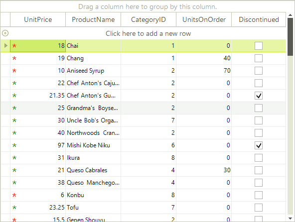

# Painting and drawing in cells

There are cases when you need to manually draw in a cell in order to extend the cell appearance and/or provide additional information to the user about the cell data. RadGridView supports this case via the CellPaint event. To enable the event firing just set __EnableCustomDrawing__ to *true*.

>note When handling this event, you should access the cell through the parameters of the event handler, rather than access the cell directly.
>

The following example demonstrates how to use the __CellPaint__ event to change the appearance of the cells in a "UnitPrice" column. We would like to add a custom drawn red asterisk to values less than 20, a green asterisk to values higher than 20, and no asterisk when the cell's value is zero:

<snippet id='gridview-paintinganddrawingincells-paintinganddrawingincells-cs' />
<snippet id='gridview-paintinganddrawingincells-paintinganddrawingincells-vb' />

>caption Figure 1: Painting in cells

# See Also
* [Accessing and Setting the CurrentCell]()

* [Accessing Cells]()

* [Conditional Formatting Cells]()

* [Creating Custom Cells]()

* [Formatting Cells]()

* [GridViewCellInfo]()

* [Iterating Cells]()

* [ToolTips]()

