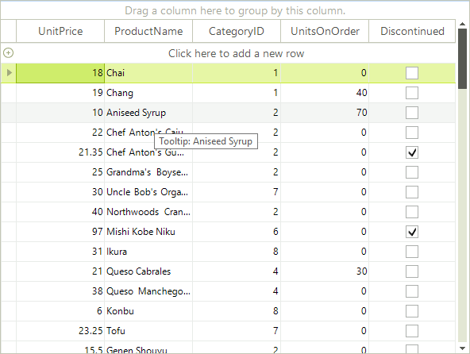
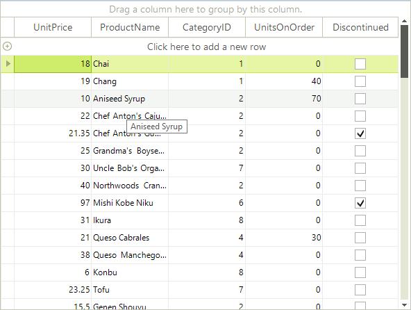

# ToolTips

There are two ways to assign tooltips to cells in __RadGridView__, namely setting the __ToolTipText__ property of a *CellElement* in the __CellFormatting__ event handler, or as in most of the RadControls by using the __ToolTipTextNeeded__ event.

## Setting tooltips in the CellFormatting event handler

The code snippet below demonstrates how you can assign a tooltip to a data cell.

<snippet id='gridview-tooltips1-cellformatting-cs' />
<snippet id='gridview-tooltips1-cellformatting-vb' />

>caption Figure 1: Using the formatting event to set the tooltips.

## Setting tooltips in the ToolTipTextNeeded event

The code snippet below demonstrates how you can use __ToolTipTextNeeded__ event handler to set __ToolTipText__ for the given __CellElement__.

<snippet id='gridview-tooltips1-tooltiptextneeded-cs' />
<snippet id='gridview-tooltips1-tooltiptextneeded-vb' />

>caption Figure 2: Using the ToolTipTextNeeded event.

>note The *ToolTipTextNeeded* event has higher priority and overrides the tooltips set in CellFormatting event handler.
>

# See Also
* [Accessing and Setting the CurrentCell]()

* [Accessing Cells]()

* [Conditional Formatting Cells]()

* [Creating Custom Cells]()

* [Formatting Cells]()

* [GridViewCellInfo]()

* [Iterating Cells]()

* [Painting and Drawing in Cells]()

* [Show Tooltips for Clipped Cell's Text]()

