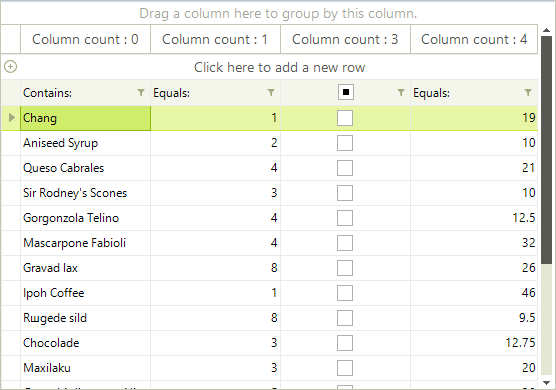

# Accessing and Iterating through Columns

## Accessing Columns

You can access any column by name or index. Generally speaking, accessing the columns by name is the preferred approach because if the user reorders the columns the indexes would also change.

For example, the code snippet below sets the width of an image column named "Picture" to 110: 

#### Accessing RadGridView columns

<snippet id='gridview-accessinganditeratingthroughcolumns-accessingcolumns-cs' />
<snippet id='gridview-accessinganditeratingthroughcolumns-accessingcolumns-vb' />

## Iterating through Columns

You can iterate through grid columns by using the __Columns__ collection of GridViewColumn objects. The example below cycles through the columns of the grid, it first determines if the column is a GridViewDataColumn type, and then sets each column’s HeaderText with the number of the current column:

#### Iterating through RadGridView columns

<snippet id='gridview-accessinganditeratingthroughcolumns-iteratingcolumns-cs' />
<snippet id='gridview-accessinganditeratingthroughcolumns-iteratingcolumns-vb' />

>caption Figure 1: Iterating columns and setting their HeaderText.

## Iterating through Hierarchical Columns

Iterating through hierarchical RadGridView is possible by iterating through the __Columns__’ collection of each RadGridView template (each template represents one level of hierarchy).

#### Iterating through hierarchical RadGridView columns

<snippet id='gridview-accessinganditeratingthroughcolumns2-iteratecolumnsinhierarchy-cs' />
<snippet id='gridview-accessinganditeratingthroughcolumns2-iteratecolumnsinhierarchy-vb' />

# See Also
* [Calculated Columns (Column Expressions)]()

* [Overview]()

* [Converting Data Types]()

* [Data Formatting]()

* [Generating Columns]()

* [GridViewColumn]()

* [GridViewDataColumn]()

* [Pinning and Unpinning Columns]()

