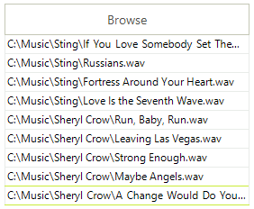

# GridViewBrowseColumn

__GridViewBrowseColumn__ allows __RadGridView__ to edit file paths using __OpenFileDialog__. The default editor of the column is __GridBrowseEditor__. 

__GridViewBrowseColumn__ is never auto-generated. The following code snippet demonstrates how to create and add the column to RadGridView and also add some sample data for it:

<snippet id='gridview-gridviewbrowsecolumn1-addbrowsecolumn-cs' />
<snippet id='gridview-gridviewbrowsecolumn1-addbrowsecolumn-vb' />

# See Also
* [GridViewCalculatorColumn]()

* [GridViewCheckBoxColumn]()

* [GridViewColorColumn]()

* [GridViewComboBoxColumn]()

* [GridViewCommandColumn]()

* [GridViewDateTimeColumn]()

* [GridViewDecimalColumn]()

* [GridViewHyperlinkColumn]()

* [GridViewSparklineColumn]()

