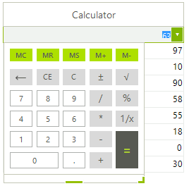

# GridViewCalculatorColumn

__GridViewCalculatorColumn__ allows RadGridView to edit numbers using popup with calculator. The default editor of the column is __RadCalculatorEditor__.

__GridViewCalculatorColumn__ is never auto-generated. The following code snippet demonstrates how to create and add the column to RadGridView and also add some sample data in it:

<snippet id='gridview-gridviewcalculatorcolumn1-addcalculatorcolumn-cs' />
<snippet id='gridview-gridviewcalculatorcolumn1-addcalculatorcolumn-vb' />

# See Also
* [GridViewBrowseColumn]()

* [GridViewCheckBoxColumn]()

* [GridViewColorColumn]()

* [GridViewComboBoxColumn]()

* [GridViewCommandColumn]()

* [GridViewDateTimeColumn]()

* [GridViewDecimalColumn]()

* [GridViewHyperlinkColumn]()

* [GridViewSparklineColumn]()

