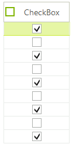
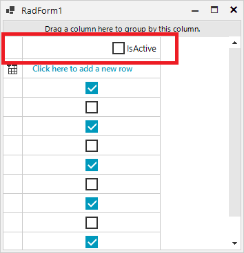
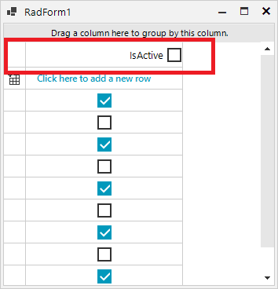

# GridViewCheckBoxColumn

__GridViewCheckBoxColumn__ displays and allows editing of boolean data. The values are shown as check boxes and allow the user to set or clear the check boxes to toggle the underlying boolean data values. __GridViewCheckBoxColumn__ inherits from __GridViewDataColumn.__

#### Create and add GridViewCheckBoxColumn

<snippet id='gridview-gridviewcheckboxcolumn1-addcheckboxcolumn-cs' />
<snippet id='gridview-gridviewcheckboxcolumn1-addcheckboxcolumn-vb' />

The column has also a built-in functionality for checking all check boxes in it, via check box placed in the column header cell. By setting the __EnableHeaderCheckBox__ property to *true* you will enable the embedded in the header cell **RadCheckBoxElement**. 

<snippet id='gridview-gridviewcheckboxcolumn1-enableheadercheckbox-cs' />
<snippet id='gridview-gridviewcheckboxcolumn1-enableheadercheckbox-vb' />

## ValueChanged event

__ValueChanged__ event can be used in particular about check box state change. You have to check the active editor type as in the example below:

<snippet id='gridview-gridviewcheckboxcolumn1-valuechanged-cs' />
<snippet id='gridview-gridviewcheckboxcolumn1-valuechanged-vb' />

## HeaderCellToggleStateChanged event

To handle the toggle state change of the embedded check box in the header cell you should use the __HeaderCellToggleStateChanged__ event of RadGridView.

<snippet id='gridview-gridviewcheckboxcolumn1-headercelltogglestatechanged-cs' />
<snippet id='gridview-gridviewcheckboxcolumn1-headercelltogglestatechanged-vb' />

## EditMode

The __EditMode__ property controls when the value of the editor will be submitted to the cell. By default, the current behavior is kept (*OnValidate*) and the value will be submitted only when the current cell changes or the grid looses focus. The new value (*OnValueChange*) will submit the value immediately after the editor value changes.

<snippet id='gridview-gridviewcheckboxcolumn1-editmode-cs' />
<snippet id='gridview-gridviewcheckboxcolumn1-editmode-vb' />

## GridViewCheckBoxColumn's Properties 

|Property|Description|
|----|----|
|**ThreeState**|Gets or sets a value indicating whether to use a three state check-box.|
|**DataType**|Gets or sets a value indicating the column's data type.|
|**EnableHeaderCheckBox**|Gets or sets a value indicating whether to show embedded check-box in header cell.|
|**Checked**|Gets a value indicating whether the check-box in header cell checked.|
|**ShouldCheckDataRows**|This property determines whether the check-box in the header cell will be synced with the data cells.|
|**EditMode**|This property determines whether changing a value of a check box will immediately be send to the cell (OnValueChange) or when the current cell is changed or the grid is being validated (OnCellChangeOrValidating).|
|**HeaderCheckBoxPosition**|Controls the position of the checkbox and the text, possible values are Left, Right and Center.|
|**HeaderCheckBoxAlignmentProperty**|Controls the alignment of the checkbox to the Text.|
|**CheckFilteredRows**|Gets or sets a value indicating if the hidden rows will be checked by the header check-box.|

|HeaderCheckBoxPosition/HeaderCheckBoxAlignment|Result|
|----|----|
|HeaderCheckBoxPosition = HorizontalAlignment.Right & HeaderCheckBoxAlignment = ContentAlignment.MiddleLeft||
|HeaderCheckBoxPosition = HorizontalAlignment.Right & HeaderCheckBoxAlignment = ContentAlignment.MiddleRight||

# See Also

* [How to Convert a GridViewCheckBoxColumn to a Custom ToggleSwitch Column]()

* [GridViewBrowseColumn]()

* [GridViewCalculatorColumn]()

* [GridViewColorColumn]()

* [GridViewComboBoxColumn]()

* [GridViewCommandColumn]()

* [GridViewDateTimeColumn]()

* [GridViewDecimalColumn]()

* [GridViewHyperlinkColumn]()

* [GridViewSparklineColumn]()

