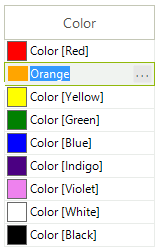
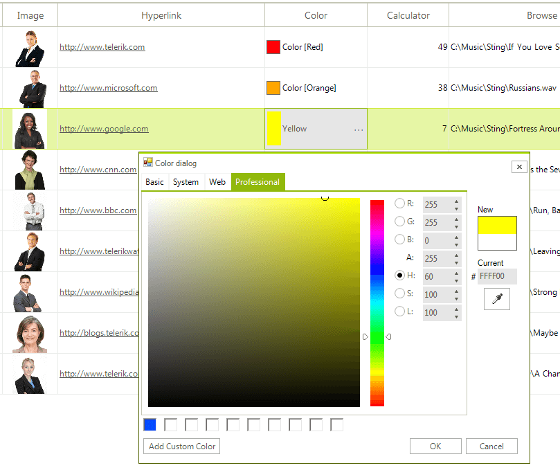

# GridViewColorColumn

__GridViewColorColumn__ allows **RadGridView** to edit colors using [RadColorDialog](). 

__GridViewColorColumn__ is auto-generated for __Color__ properties in the RadGridView.**DataSource**. The following code snippet demonstrates how to create it manually, add it to **RadGridView** and populate it with data:

<snippet id='gridview-gridviewcolorcolumn1-addcolorcolumn-cs' />
<snippet id='gridview-gridviewcolorcolumn1-addcolorcolumn-vb' />

## GridColorPickerEditor

The default editor of the **GridViewColorColumn** is __GridColorPickerEditor__ which can be accessed in the **CellEditorInitialized** event. The **RadColorPickerEditorElement** gives you full access to the **RadColorDialogForm** by accessing the GridColorPickerElement.ColorDialog.**ColorDialogForm** property.

# See Also
* [GridViewBrowseColumn]()

* [GridViewCalculatorColumn]()

* [GridViewCheckBoxColumn]()

* [GridViewComboBoxColumn]()

* [GridViewCommandColumn]()

* [GridViewDateTimeColumn]()

* [GridViewDecimalColumn]()

* [GridViewHyperlinkColumn]()

* [GridViewSparklineColumn]()

