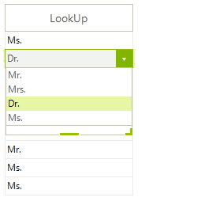
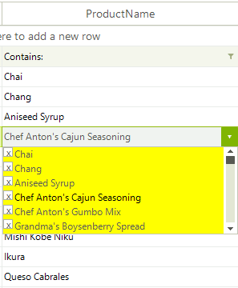

# GridViewComboBoxColumn

__GridViewComboBoxColumn__ displays a set of predefined text values in a drop down list. This column type is typically used to provide a lookup into some set of relatively static values. To use __GridViewComboBoxColumn:__

* Set the __DataSource__ property to the data source that contains possible values to choose from.

* Set the __DisplayMember__ property to the column of the __DataSource__ that should be displayed in the drop down list.

* Set the __ValueMember__ property to the column of the __DataSource__ that should be used to update the cell within the grid represented by the __FieldName__ property.

>note Values will display in the column only if the value in __FieldName__ is within the range of values provided by the __ValueMember__ field values.
>

Other important properties for __GridViewComboBoxColumn__ are:

|Property|Description|
|----|----|
|**FilterMode**|It has two values and determine whether the column will be filtered according to the __DisplayMember__ or the __ValueMember__.|
|**DisplayMemberSort**|This property will determine whether the column will be sorted by the column's __DisplayMember__ or __ValueMember__. Setting it to *true* will sort by __DisplayMember__, otherwise the sorting will be executed according to the __ValueMember__.|
|**SyncSelectionWithText**|Gets a value that indicates the SelectedIndex will be synchronized with text in Editable area.|
|**AutoCompleteMode**|Specifies the mode for the automatic completion feature used in the **RadDropDownListEditor**.|
|**DropDownStyle**|Gets or sets a value specifying the style of the **RadDropDownListEditor**.|
|**HasLookupValue**|Gets a value indicating whether this column has look-up value.|

>note By default, when sorting is executed on **GridViewComboBoxColumn** it is sorted according to its __ValueMember__ setting. However, if you need to perform the sorting according to the **DisplayMember** instead, you should set the __DisplayMemberSort__ property of the column.

The useful methods for **GridViewComboBoxColumn** are:

|Method|Description|
|----|----|
|**GetLookupValue**|Returns the look-up value for the specified cell value.|
|**GetDefaultEditorType**|Returns the default editor type.|
|**GetDefaultEditor**|Returns the default editor. |

>caption Figure 1: GridViewComboBoxColumn

#### Adding and binding GridViewComboBoxColumn

<snippet id='gridview-gridviewcomboboxcolumn1-addcomboboxcolumn-cs' />
<snippet id='gridview-gridviewcomboboxcolumn1-addcomboboxcolumn-vb' />

>important If you want to set initial values, you should match the __GridViewComboBoxColumn__ to a column which has appropriate values in it. To do this, you should set the __FieldName__ of the __GridViewComboBoxColumn__ to be the same as the name of the existing column.

The displayed text in a cell can be retrieved by calling the __GetLookupValue__ on the __GridViewComboBoxColumn__. 

#### Get Cell Text

<snippet id='gridview-gridviewcomboboxcolumn1-getlookupvalue-cs' />
<snippet id='gridview-gridviewcomboboxcolumn1-getlookupvalue-vb' />

>important The stored values inside the cells belonging to this column corresponds to the **ValueMember** field that is specified. In the above example, **SupplierID** is applied as ValueMember. Hence, the cells stores the numeric IDs of the suppliers. In case you are using unbound mode for the grid and the grid rows are programmatically added, you have to specify again a value that corresponds to the specified **ValueMember**.

In order to access the __RadDropDownListEditor__, you should subscribe to the __CellEditorInitialized__ event of __RadGridView__. This event is fired when the initialization of an editor is done. The __EditorElement__ property of the __RadDropDownListEditor__ gives you access to the __RadDropDownListEditorElement__ which allows you to apply various customizations to the editor's element:

#### Modify the DropDownList editor

<snippet id='gridview-gridviewcomboboxcolumn1-modifythecomboboxeditor-cs' />
<snippet id='gridview-gridviewcomboboxcolumn1-modifythecomboboxeditor-vb' />

## Binding to array of strings

The following example demonstrates a case where the combo box is bound to a column with string values in the data source. In this case the __DisplayMember__ and __ValueMember__ properties are the same, and you need just an array of strings as a data source to the ComboBoxColumn (those strings should be equal to the possible values in the data source):

#### Bind to array of string

<snippet id='gridview-gridviewcomboboxcolumn1-bindtoarray-cs' />
<snippet id='gridview-gridviewcomboboxcolumn1-bindtoarray-vb' />

## Binding to collection of custom object

The example below extends the previous sample, where we bound the combo column to array of strings, by adding a text box column and another combo column, this time bound to a collection of custom object. 

1\. The first step is to define your grid data source, fill in some data, and set column auto-generation to __false__ so that the grid does not generate its columns from the data source. 

2\.Next, the grid columns are created and mapped to the data base columns. Note that you have to define a __separate__ data source for each of your combo box columns different form the one of your grid. This separate data sources have helper function, the actual data for your combobox columns is still in your grid data source as it is for any other type of column (e.g. decimal column). The data source for the first combo column is a string array (from the previous example) and for the second combo column is a __BindingList__. The **BindingList** consists of objects having properties for your value and display members. In the sample code below, __Id__ is the __ValueMember__ and __MyString__ is the ___DisplayMember___. The *"Another ComboBox column"* in the grid data source is of type __int__ and our custom object has a property of type __int__. So in order to link the data source field to our custom object integer field, we have set the __ValueMember__ to __"Id"__. You may use a **DataTable** in the same way like the **BindingList**.

#### Binding to collection of custom object

<snippet id='gridview-gridviewcomboboxcolumn2-bindtoobject-cs' />
<snippet id='gridview-gridviewcomboboxcolumn2-bindtoobject-vb' />

##  Customizing DropDownList editors in RadGridView

You have to handle the **EditorRequired** event. This event is fired every time when an editor needs to be shown. A sample code demonstrating this technique:

####  Customizing DropDownList editors in RadGridView

<snippet id='gridview-gridviewcomboboxcolumn3-customizedropdownlisteditor-cs' />
<snippet id='gridview-gridviewcomboboxcolumn3-customizedropdownlisteditor-vb' />

>caption Figure 2: The items styles are now changed.

## Examples

You can check the following SDK project which demonstrates how you can use the GridViewComboBoxColumn in different scenarios:

* [CascadingComboboxes](https://github.com/telerik/winforms-sdk/tree/master/GridView/CascadingComboboxes)
* [GridViewComboxColumnCustomValue](https://github.com/telerik/winforms-sdk/tree/master/GridView/GridViewComboxColumnCustomValue)
* [LoadOnDemandComboBoxInGrid](https://github.com/telerik/winforms-sdk/tree/master/GridView/LoadOnDemandComboBoxInGrid)

## See Also

* [How to Filter a GridViewComboBoxColumn by DisplayMember]()

* [GridViewBrowseColumn]()

* [GridViewCalculatorColumn]()

* [GridViewCheckBoxColumn]()

* [GridViewColorColumn]()

* [GridViewCommandColumn]()

* [GridViewDateTimeColumn]()

* [GridViewDecimalColumn]()

* [GridViewHyperlinkColumn]()

* [GridViewSparklineColumn]()

* [Display Text for Invalid Values in GridView's Combobox Column]()

