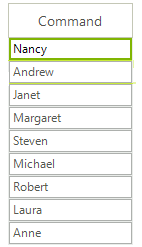

# GridViewCommandColumn

__GridViewCommandColumn__ displays a button element that responds to user input mouse clicks and keyboard key presses. Either mouse click or keyboard input fires the __CommandCommandCellClick__ event. The button text can be supplied through the column __FieldName__ property values or by the column __DefaultText__ property. To display the same button text for every cell, set the __UseDefaultText__ property to *true* and the __DefaultText__ property to the value you want displayed in the button. __UseDefaultText__ is *false* by default. __GridViewCommandColumn__ inherits from __GridViewDataColumn.__

The example below creates two __GridViewCommandColumns__. The first has __UseDefaultText__ set to  *false* and so displays the __FieldName__ value for "ProductName" in the button text. The second has the __UseDefaultText__ property set to *true* and the __DefaultText__ property set to "Order". In both cases the RadGridView.__CommandCellClick__ reacts to a mouse click, casts "sender" to be __GridCommandCellElement__ and makes use of the __Value__ property.

#### Add GridViewCommandColumn to the grid.

<snippet id='gridview-gridviewcommandcolumn1-addcommandcolumn-cs' />
<snippet id='gridview-gridviewcommandcolumn1-addcommandcolumn-vb' />

## Buttons Styles

You can use the __Image__ and __TextImageRelation__ properties of the **GridViewCommandColumn** in order to set the image for all buttons in the grid. 

The following article shows how you can access the buttons in the **CellFormating** event and change their styles: [Formatting GridViewCommandColumn]().

# See Also
* [GridViewBrowseColumn]()

* [GridViewCalculatorColumn]()

* [GridViewCheckBoxColumn]()

* [GridViewColorColumn]()

* [GridViewComboBoxColumn]()

* [GridViewDateTimeColumn]()

* [GridViewDecimalColumn]()

* [GridViewHyperlinkColumn]()

* [GridViewSparklineColumn]()

* [How to Filter GridViewCommandColumn in RadGridView]()

