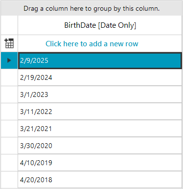
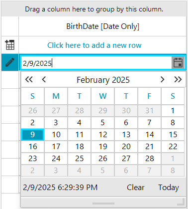
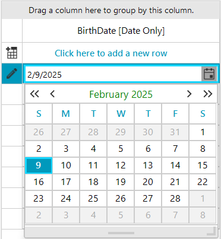

# GridViewDateOnlyColumn 

**GridViewDateOnlyColumn** can display and edit values of DateOnly type. DateOnly structure was introduced with .NET 6 and represent a specific date, such as a birth date. Since it has no time component, it represents a date from the start of the day to the end of the day. DateOnly has a range from 0001-01-01 through 9999-12-31, just like DateTime. 

Prior to the DateOnly type being introduced, programmers typically used either the [GridViewDateTimeColumn]() (using DateTime type) to represent an exact date. Now, the **GridViewDateOnlyColumn** enables users to manage DateOnly values effectively and organize their work precisely in a date format disregarding the time part.

>important GridViewDateOnlyColumn requires .NET 6 or later. [DateOnly](https://learn.microsoft.com/en-us/dotnet/api/system.dateonly?view=net-9.0) type isn't available for .NET Framework.

>caption Figure 1: GridViewDateOnlyColumn



#### Add GridViewDateOnlyColumn to the grid

````C#
GridViewDateOnlyColumn dateOnlyColumn = new GridViewDateOnlyColumn();
dateOnlyColumn.Format = DateTimePickerFormat.Short;
dateOnlyColumn.FieldName = "BirthDate";
dateOnlyColumn.HeaderText = "BirthDate [Date Only]";
this.radGridView1.Columns.Add(dateOnlyColumn);

````
````VB.NET
Dim dateOnlyColumn As GridViewDateOnlyColumn = New GridViewDateOnlyColumn()
dateOnlyColumn.Format = DateTimePickerFormat.Short
dateOnlyColumn.FieldName = "BirthDate"
dateOnlyColumn.HeaderText = "BirthDate [Date Only]"
Me.radGridView1.Columns.Add(dateOnlyColumn)

````

### Editing GridViewDateOnlyColumn 

When the user starts editing a GridDateOnlyCellElement, **RadDateOnlyEditor** activates automatically. RadDateOnlyEditor shows a [RadDateOnlyPicker]() in a popup giving a possibility to choose any diffirent date from a calendar. To customize the behavior of RadDateOnlyEditor, you need to subsribe to **CellEditorInitialized** event. 

>caption Figure 2: RadDateOnlyEditor



>note For more informaiton please check [Customize RadCalendar Programmatically]().

#### Customize the calendar inside RadDateOnlyEditor

````C#

private void RadGridView1_CellEditorInitialized(object sender, GridViewCellEventArgs e)
{
    RadDateOnlyEditor dateOnlyEditor = e.ActiveEditor as RadDateOnlyEditor;
    if (dateOnlyEditor != null)
    {
        RadDateOnlyEditorElement dateOnlyEditorElement = dateOnlyEditor.EditorElement as RadDateOnlyEditorElement;
        RadDateOnlyPickerCalendar calendarBehavior = dateOnlyEditorElement.CurrentBehavior as RadDateOnlyPickerCalendar;
        RadCalendar calendar = calendarBehavior.Calendar as RadCalendar;
        calendar.CalendarElement.CalendarNavigationElement.ForeColor = Color.Green;
        calendar.ShowFooter = false;
    }
}

````
````VB.NET
Private Sub RadGridView1_CellEditorInitialized(ByVal sender As Object, ByVal e As GridViewCellEventArgs)
    Dim dateOnlyEditor As RadDateOnlyEditor = TryCast(e.ActiveEditor, RadDateOnlyEditor)

    If dateOnlyEditor IsNot Nothing Then
        Dim dateOnlyEditorElement As RadDateOnlyEditorElement = TryCast(dateOnlyEditor.EditorElement, RadDateOnlyEditorElement)
        Dim calendarBehavior As RadDateOnlyPickerCalendar = TryCast(dateOnlyEditorElement.CurrentBehavior, RadDateOnlyPickerCalendar)
        Dim calendar As RadCalendar = TryCast(calendarBehavior.Calendar, RadCalendar)
        calendar.CalendarElement.CalendarNavigationElement.ForeColor = Color.Green
        calendar.ShowFooter = False
    End If
End Sub

````

>caption Figure 3: The result in RadDateOnlyEditor from the above code snippet



            
# See Also
* [GridViewDateOnlyColumn]()

* [GridViewDateTimeColumn]()

* [GridViewTimeSpanColumn]()

* [GridViewDecimalColumn]()

* [GridViewComboBoxColumn]()

