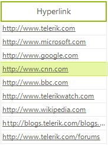

# GridViewHyperlinkColumn

__GridViewHyperlinkColumn__ allows __RadGridView__ to display, format, edit and open hyperlinks as well as run executable files. The default editor of the column is __RadTextBoxEditor__.

Here is how to create and populate __GridViewHyperlinkColumn__:

<snippet id='gridview-gridviewhyperlinkcolumn1-addhyperlinkcolumn-cs' />
<snippet id='gridview-gridviewhyperlinkcolumn1-addhyperlinkcolumn-vb' />

## Behavior customization

You can choose the action to open hyperlink or run executable using the __HyperlinkOpenAction__ property of the column. It is an enumeration with the following members:

* __SingleClick:__ opens the hyperlink on single mouse click

* __DoubleClick:__ opens the hyperlink on double mouse click 

* __None:__ the user cannot open the link.

The __HyperlinkOpenArea__ property of the column determines whether to execute the hyperlink upon click on the cell or upon click on the text of the cell.
        

## Appearance

The __RadGridView__ theme could define styles for the following __GridViewHyperlinkColumn__ cells states:
        

* __Default (unvisited)__

* __Hovered__

* __Clicked__

* __Visited__

The mouse cursor transforms into ‘*hand*’ when hovering hyperlink from the column. 

## Cell Customization

The hyperlink cells can be further customized through the **CellFormating** event of the **RadGridView**. In the event handler, we can check if the **e.CellElement** property is a **GridHyperlinkCellElement** element. If yes, we can modify the look of the cell.

<snippet id='gridview-gridviewhyperlinkcolumn1-customizehyperlinkcolumncell-cs' />
<snippet id='gridview-gridviewhyperlinkcolumn1-customizehyperlinkcolumncell-vb' />

## Events

Here are the __GridViewHyperlinkColumn__ specific events:

* __HyperlinkOpening:__ cancelable event which is raised before opening the hyperlink

* __HyperlinkOpened:__ event which is raised after opening the link.

The following example demonstrates how to replace the default **GridViewTextBoxColumn** with a **GridViewHyperlinkColumn** which stores emails. When an email hyperlink is clicked, a mail message is opened in the default Mail application:

<snippet id='gridview-gridviewhyperlinkcolumn1-emailcolumn-cs' />
<snippet id='gridview-gridviewhyperlinkcolumn1-emailcolumn-vb' />

# See Also

* [GridViewBrowseColumn]()

* [GridViewCalculatorColumn]()

* [GridViewCheckBoxColumn]()

* [GridViewColorColumn]()

* [GridViewComboBoxColumn]()

* [GridViewCommandColumn]()

* [GridViewDateTimeColumn]()

* [GridViewDecimalColumn]()

* [GridViewSparklineColumn]()

