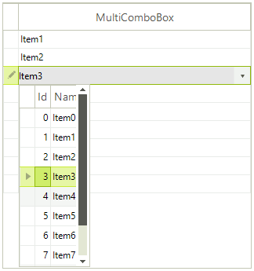

# GridViewMultiComboBoxColumn

This column has __RadMultiColumnComboBoxElement__ as an editor. It covers the features that the RadMultiColumnComboBox control has.

The following example demonstrates how to [manually generate columns for RadGridView]() in the dropdown and then make the dropdown autosize itself according to the width of the RadGridView columns.

First of all, we should bind the GridViewMultiComboBoxColumn:

<snippet id='gridview-gridviewmulticomboboxcolumn1-addcolumn-cs' />
<snippet id='gridview-gridviewmulticomboboxcolumn1-addcolumn-vb' />

Then, we make the necessary implementation in the CellBeginEdit event handler:

#### Setup the editor

<snippet id='gridview-gridviewmulticomboboxcolumn1-setuptheeditor-cs' />
<snippet id='gridview-gridviewmulticomboboxcolumn1-setuptheeditor-vb' />

Please note that we have a 'dirty' flag, because the editors in RadGridView are reused. If we do not have such a flag, new OrderID and Quantity columns will be added each time a RadMultiColumnComboBoxElement editor is opened. 

Other important properties for __GridViewMultiComboBoxColumn__ are:

* __FilterMode:__ has two values __DisplayMember__ and __ValueMember__, and as the name of the property speaks this setting will determine whether the column will be filtered according to the __DisplayMember__ or the __ValueMember__.

* __DisplayMemberSort:__ this property will determine whether the column will be sorted by the column's __DisplayMember__ or __ValueMember__.  Setting it to *true* will sort by __DisplayMember__, otherwise the sorting will be executed according to the __ValueMember__.

# See Also

* [GridViewBrowseColumn]()

* [GridViewCalculatorColumn]()

* [GridViewCheckBoxColumn]()

* [GridViewColorColumn]()

* [GridViewComboBoxColumn]()

* [GridViewCommandColumn]()

* [GridViewDateTimeColumn]()

* [GridViewDecimalColumn]()

* [GridViewSparklineColumn]()

