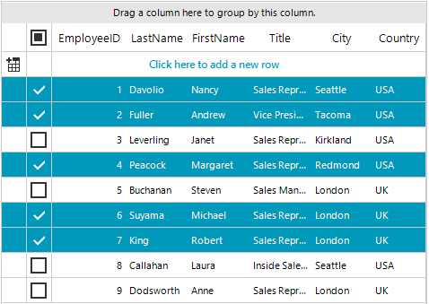
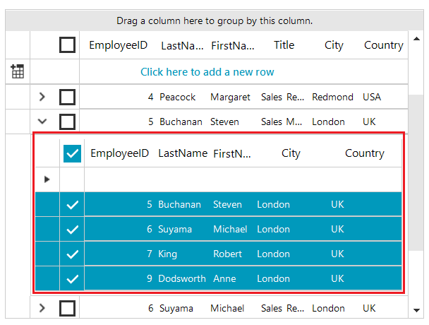

# GridViewSelectColumn

**GridViewSelectColumn** is used to mark whether a row is selected or not by displaying a checkbox for each row. It is positioned just before the first data column in **RadGridView**. Unlike other data column types, the **GridViewSelectColumn**  inherits from [GridViewColumn]() and does not bind to data. This feature extends the selection UI experience and allows the end users to select or deselect rows from the grid by using a checkbox. It is supported in grouping, paging, hierarchy mode, etc. 

#### Show GridViewSelectColumn

The **ShowSelectColumn** property indicates whether the select column is visible. The default value of this property is *false*. Also, this column is not auto-generated. 

To show **GridViewSelectColumn** it is necessary to set the **ShowSelectColumn** property to *true*. 

>caption Figure 1: Show GridViewSelectColumn

<snippet id='gridview-gridviewselectcolumn-showselectcolumn-cs' />
<snippet id='gridview-gridviewselectcolumn-showselectcolumn-vb' />

>note **GridViewSelectColumn** is only supported in GridViewSelectionMode.**FullRowSelect**. In *FullRowSelect* mode the user is able to select full rows in the grid, while in *CellSelect* mode it is possible to select single cells. For more information see [Row selection]().

#### Multiple Selection

If the *MultiSelect* property is enabled, users can make a [multiple selection in RadGridView](). When using the selection UI through GridViewSelectColumn, the users will be able to select multiple rows by simply checking a checkbox. If *MultiSelect* property is *false*, the users can select only a single row/cell. 

#### Row selection via checkboxes only

In some cases, the user may need to use multiple row selection through the **GridViewSelectColumn** only. The **UseCheckboxRowSelectionOnly** property defines whether the user can select rows only via the checkboxes. When **UseCheckboxRowSelectionOnly** is set to *true*, the selection only via checkboxes is allowed. Thus, if you click with the mouse over different rows they will not get selected, until you check the corresponding checkbox from the **GridViewSelectColumn**. 

<snippet id='gridview-gridviewselectcolumn-checkboxrowselection-cs' />
<snippet id='gridview-gridviewselectcolumn-checkboxrowselection-vb' />

>note The **UseCheckboxRowSelectionOnly** will only be considered if **ShowSelectColumn** is set to *true*.

#### Hierarchy mode

**GridViewSelectColumn** is also supported when RadGridView is bound to hierarchical data and child templates in the hierarchy view are shown. In case you would like to enable this setting in a hierarchy, it is necessary to set **ShowSelectColumn** to the respective child template:

>caption Figure 2: Show GridViewSelectColumn in Hierarchy

<snippet id='gridview-gridviewselectcolumn-selectcolumninhierarchy-cs' />
<snippet id='gridview-gridviewselectcolumn-selectcolumninhierarchy-vb' />

>note This feature is also available in other functionalities that RadGridView offers such as grouping, filtering, searching, paging.

#### SelectColumnWidth

**SelectColumnWidth** property gets or sets the width of the GridViewSelectColumn.

<snippet id='gridview-gridviewselectcolumn-setselectcolumnwidth-cs' />
<snippet id='gridview-gridviewselectcolumn-setselectcolumnwidth-vb' />

#### Events

Every time when а row is checked/unchecked and the selection has changed, RadGridView triggers the following events:

* **SelectionChanging**: Fires when the current selection is about to be changed. Allows to be canceled. 
* **SelectionChanged**: Fires when the current selection is changed.

## See Also
* [GridViewBrowseColumn]()

* [GridViewCalculatorColumn]()

* [GridViewCheckBoxColumn]()

* [GridViewColorColumn]()

* [GridViewComboBoxColumn]()

* [GridViewCommandColumn]()

* [GridViewDateTimeColumn]()

* [GridViewDecimalColumn]()

* [GridViewSparklineColumn]()

